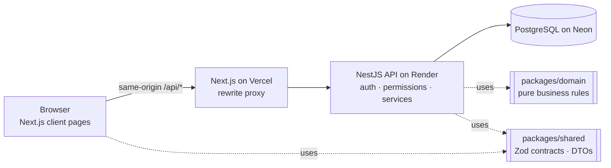
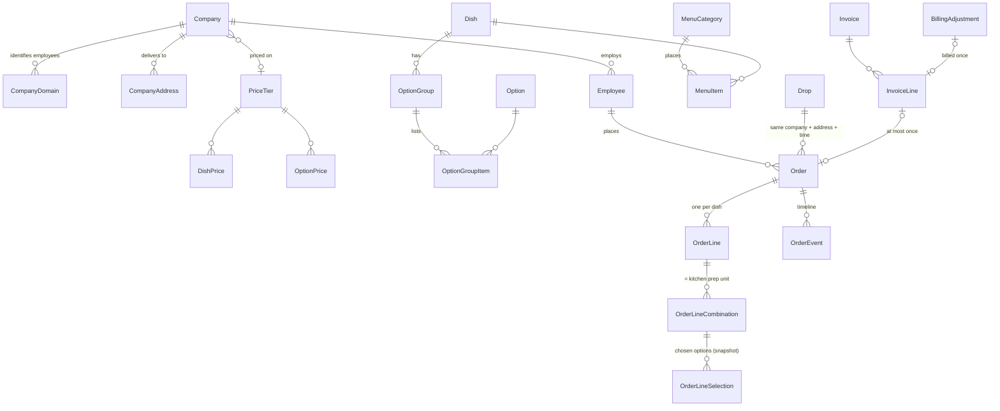

# Fernleaf Kitchen Operations — Admin Panel

An internal admin panel for **Fernleaf Kitchen**, which cooks boxed corporate lunches in Hyderabad and delivers them to client offices. One app covers the whole day:

- **Ordering:** order on behalf of employees, with a cut-off and per-company menus and prices.
- **Kitchen board:** what to cook, by station and deadline.
- **Dispatch:** drops, drivers and delivery stages.
- **Driver view:** built for a phone.
- **Company billing:** invoices, payments and credits.
- **Admin:** catalogue, pricing, menu, companies, employees, staff and settings.
- **Dashboard:** one per role.

**Stack:** Next.js 16 (web) · NestJS 11 (API) · Prisma 7 · PostgreSQL (Neon) · TypeScript end to end, in a pnpm/Turborepo monorepo.

## Live demo

| | |
|---|---|
| App | **https://kitchen-ops-pied.vercel.app** (Vercel) |
| API health | https://fernleaf-api-s468.onrender.com/api/health/live (Render, Singapore). An uptime monitor pings it every 5 minutes so the free instance stays awake. |

| Role | Email | Password | Lands on |
|---|---|---|---|
| Admin | `admin@test.com` | `Test@1234` | Admin dashboard: service, cut-off, receivables, catalogue health |
| Kitchen | `kitchen@test.com` | `Test@1234` | Kitchen dashboard → board and cook list |
| Dispatch | `dispatch@test.com` | `Test@1234` | Dispatch dashboard → drops board |
| Driver | `driver@test.com` | `Test@1234` | “My day” → today’s drops (try it on a phone) |

**The data is alive on whatever day you look.** A generator keeps the last two weeks, today and the next week filled with realistic orders, all priced and validated by the same rules as the app. An autopilot moves them along by the clock: units get cooked, drops leave and are delivered, and older weeks are invoiced. Wednesdays carry about 400 orders. Today’s drops for `driver@test.com` wait at “dispatch-ready”, so you can pick them up and deliver them yourself. Anything a person touches is left alone by the autopilot.

Things to try:
- **Orders:** place an order for an employee and watch the live price breakdown.
- **Cut-off:** close a future date early from *Settings → Cut-off console*; drafts are cancelled and placed orders confirmed.
- **Kitchen and dispatch:** mark kitchen units done, then advance the drop on the dispatch board.
- **Billing:** invoice a company, mark the invoice paid, then cancel an invoiced order and see the credit it creates.

## Running it locally

Prerequisites: Node ≥ 24, pnpm 10 (`npm i -g pnpm`), a PostgreSQL database (a free Neon project is enough).

```bash
pnpm install
cp apps/api/.env.example apps/api/.env     # set DATABASE_URL, DIRECT_URL, JWT_SECRET
cp apps/web/.env.example apps/web/.env     # API_URL=http://localhost:4000
pnpm build                                 # generates the Prisma client, builds the shared packages and apps
pnpm --filter @fernleaf/api db:deploy      # apply migrations
pnpm --filter @fernleaf/api db:seed        # catalogue, tiers, menu, 6 companies, ~490 employees, the 4 accounts
pnpm dev                                   # web on :3000, API on :4000
```

With `DEMO_DATA_ENABLED=true` the API fills the demo window a few seconds after it starts. `pnpm --filter @fernleaf/api demo:reset -- --yes` wipes orders, drops and invoices; the base seed stays.

## Deployment

| Piece | Where | How |
|---|---|---|
| Web | Vercel (`sin1`), project root `apps/web` | `apps/web/vercel.json`; one environment variable, `API_URL`. The browser only calls `/api/*` on the same origin, and Vercel forwards it to the API. |
| API | Render free web service, Singapore | `render.yaml` blueprint: build with pnpm, start with `prisma migrate deploy` + `node dist/main.js`. Secrets (`DATABASE_URL`, `DIRECT_URL`, `JWT_SECRET`) are set in the dashboard only. |
| Database | Neon PostgreSQL, Singapore | Migrations are applied on API start; the base seed is run once from a dev machine. |
| Uptime | UptimeRobot | `GET /api/health/live` every 5 minutes (no database query, so the database can idle). |

Every push to `main` redeploys both the web app and the API automatically.

## Architecture



- **`packages/domain`:** pure, framework-free rules with no I/O, unit-tested under three time zones:
  - money and 5¢ rounding, cut-off instants, price-tier resolution, menu resolution;
  - combination validation and pricing, planned times and risk, billing maths.
- **`packages/shared`:** Zod schemas and DTOs used by both the API (validation) and the web (forms, types), plus the permission catalogue and error codes.
- **`apps/api`:** NestJS modules per area. A deny-by-default guard checks **permissions, never role names**, so roles are just data. Every rule is enforced on the server; one error envelope.
- **`apps/web`:** Next.js App Router with client data fetching (TanStack Query), shadcn/ui, and optimistic updates on the boards. The browser only talks to its own origin; `/api/*` is proxied, so the session is a first-party httpOnly cookie and there is no CORS.

More: [`docs/ARCHITECTURE.md`](docs/ARCHITECTURE.md), [`docs/TRD.md`](docs/TRD.md).

## Data model (core)



**Orders snapshot everything they need:** dish names, option names, unit prices and costs. Later catalogue or price changes never alter an existing order.

**Effective prices are never stored.** They are computed on read from explicit prices and tier rules, and captured onto the order when it is placed.

The full schema, with every constraint and index, is in [`docs/DATABASE_MODELS.md`](docs/DATABASE_MODELS.md).

## Key decisions and trade-offs

| Decision | Why | Cost |
|---|---|---|
| Business rules in a pure `domain` package, shared contracts in `shared` | The live order quote and the actual write run the same code; rules are unit-testable | Rows must be mapped into domain inputs |
| Permission-based access; roles are rows listing permissions | A new role is a data change; no `if role === 'ADMIN'` anywhere | The permission catalogue must stay tidy |
| **A combination row is the kitchen prep unit** | No duplicated kitchen state that could drift from the order | Kitchen timestamps live on an order-content table |
| Drops are persisted, keyed by (date, company, address, time) | A real thing to assign a driver to and record notes, photos and on-time on | Membership is maintained when an admin changes delivery details |
| Cut-off processing is idempotent and lock-serialised; it runs on a timer, lazily before reads, and from a console | Correct even if the server slept through the cut-off; reviewers can trigger it | A cheap in-memory check on read paths |
| Concurrency by row locks + compare-and-set + optimistic versions | Two cooks pressing “done”, two dispatchers, two invoices for one order: exactly one wins, the other gets a clear 409 | Every money write bumps the order version |
| Invoices are immutable; later changes become **adjustments** on the next invoice | Accounting-correct and history-safe | An invoice can contain credit lines |
| Integer cents; multipliers as integer basis points; derived prices rounded **up** to 5¢ by integer maths | Exact money (no floats anywhere) | Formatting only at the edges |
| Demo data generated through real code, moved along by an autopilot | The app is alive on any review day | Demo code ships in production behind `DEMO_DATA_ENABLED` |
| Delivery photos stored in Postgres behind a `FileStore` interface | No extra storage account; swapping to S3/R2 touches one class | Database growth at scale |

### Time zone and money

**Time.** All times are **Asia/Kolkata (IST, UTC+5:30)**, the kitchen’s zone, fixed per deployment:
- “Today”, cut-offs, planned times and dashboards are computed on the server in that zone; the browser’s zone is never used.
- Delivery dates are SQL `DATE`, times of day are minutes, instants are `timestamptz`.

**Money.** Amounts are in **USD**, pre-tax, stored as integer cents.

### Policy for orders that change after invoicing (BIL-06)

Invoices never change once issued; only their status moves to *Paid*. After an order is invoiced:
- **Non-money changes** (delivery time, address, packaging) are still allowed.
- **Changes to dishes or quantities** are blocked (`ORDER_INVOICED`).
- **Cancelling or rejecting** an invoiced order automatically creates a **credit** for what was billed. It appears as a separate line on the company’s next invoice, so the order nets to zero. A cancelled order that was *never* invoiced but already carried a credit gets the opposite entry, so nothing is owed either way.
- **Short deliveries and price corrections** are manual credits or debits. Credits for an order can never exceed what was billed for it.

Invoices can contain only credits (a credit note). There is no voiding: mistakes are fixed with adjustments. These rules run inside the same transactions as the order changes and are covered by integration tests.

## Dashboard definitions

Conventions:
- “Today” is the kitchen date (IST), from the server. Orders are grouped by **delivery date**.
- **Committed** means *Confirmed* or *Delivered*. Drafts and placed orders can still change; cancelled and rejected orders never count towards work or revenue.
- Money is pre-tax at the captured prices.
- A ratio with nothing to divide by shows **“—”**, never 0 % or 100 %.

| Role | Figure | Definition |
|---|---|---|
| Admin | Today’s orders (A1) | Committed orders delivering today; boxes = sum of line quantities; booked value = sum of totals. Today’s cancelled/rejected count is shown beside it. |
| | Kitchen progress (A2) | Done prep units ÷ all prep units of today’s committed orders; late units now |
| | Deliveries today (A3) | Delivered drops ÷ today’s drops; on-time = on-time ÷ delivered |
| | Next cut-off (A4) | Nearest delivery date (3 weeks ahead) whose cut-off is still ahead and not closed early: when it closes, placed orders and their value (to be confirmed), drafts (to be cancelled) |
| | Booked value, 14 days (A5) | Sum of committed order totals per delivery date for the 14 dates up to today (chart with a table view) |
| | Receivables (A6) | Unbilled = committed orders on no invoice + pending adjustments (top 5 companies). Outstanding = unpaid invoices, count, oldest issue date |
| | Catalogue health (A7) | Active items with no effective price per tier (link to the grid filtered to missing); companies without an owner or default driver |
| Kitchen | Workload by station (K1) | Today’s units and boxes per station, split not started / cooking / done; “Unassigned” is its own row |
| | Next deadlines (K2) | Not-done units grouped by planned kitchen-ready time, the next 5 slots |
| | Late / at risk (K3) | Not-done units past their kitchen-ready time (late) or within the at-risk window, default 30 min |
| | Production summary (K4) | Per dish: boxes done/total and the most-ordered combination (full list on the cook list page) |
| | Allergen watch (K5) | Units per allergen (dish + chosen options); units containing an allergen the employee declared (should be 0) |
| | Tomorrow (K6) | Units and boxes by station for tomorrow’s committed orders; marked provisional (with “placed so far”) until its cut-off passes |
| Dispatch | Drops by stage (D1) | Today’s drops: waiting for kitchen · ready to dispatch · dispatch-ready · out for delivery · delivered |
| | No driver (D2) | Today’s drops not yet out with no driver |
| | Late / at risk (D3) | Drops not yet out past (or near) their planned leave-kitchen time; drops delivered late today |
| | Driver load (D4) | Per driver: drops today, still to go, boxes, next departure; drops without a driver form an “Unassigned” row |
| | On-time rate (D5) | On-time ÷ delivered drops for each of the last 7 delivery dates |
| Driver | My day (R1, R2) | Own drops today in time order with the next one highlighted; own on-time rate today |

Deliberately **not shown**:
- **Profit or margin.** Costs are hand-entered estimates and would suggest false precision.
- **Forecasts.**
- **Per-employee analytics.**
- **Money on the kitchen and dispatch dashboards.**

Full text: [`docs/PRD.md` §8](docs/PRD.md).

## What was built, what was skipped, and why

**Built (all “Must”):**
- **Ordering:** combinations, portions, live quote, line diff on edit, timeline.
- **Cut-off:** scheduler, lazy and manual processing, close early.
- **Kitchen:** board, cook list, force-complete.
- **Dispatch and driver:** dispatch board; driver phone view with on-device photo compression.
- **Billing:** invoices, payments, adjustments.
- **Catalogue and pricing:** reference data, options, dishes, option groups, price tiers with derivation and a whole-tier grid.
- **Menu:** management plus an employee preview that explains what’s left out.
- **People and settings:** companies (domains, addresses, calendars, visibility), employees (move), staff, settings.
- **Dashboards:** one per role.
- **Should-haves:** portions and CSV import of employees with a dry-run report.

**Skipped / simplified, on purpose:**
- **A pricing matrix (dishes × all tiers):** the per-tier grid covers the job.
- **Dish image upload:** dishes take an image link. The file store exists (delivery photos use it), so upload is a small addition.
- **Invoice voiding, tax, payment integration, notifications, audit log:** outside the brief or explicitly out of scope; mistakes are corrected with adjustments.
- **Kitchen holidays added after orders exist:** they don’t touch existing orders; the calendar simply stops offering the date.

**What I’d do next:**
- Dish image upload, and a small “report a problem” flow from the driver view that creates a short-delivery credit.
- Server-side pagination and virtualisation of the kitchen board beyond ~600 units per day.
- Per-order SLA analytics.
- A `Kitchen` entity for multiple kitchens and time zones.
- Moving delivery photos to object storage.

## Ambiguities and how I read them

The brief leaves a number of things open. Each interpretation is written down, applied consistently, and enforced on the server. The ones that shape behaviour most:

- **Cut-off counting:** count back N **kitchen working days** (holidays skipped) from the delivery date and lock at the cut-off time, in IST. Once a date is processed, it stays locked even if settings change later.
- **After the cut-off:** only admins can change, cancel or add orders. An admin order for a locked date is created directly as **Confirmed**.
- **Prices are captured when an order is placed:** drafts are re-priced on placing; editing a placed order re-prices only the lines that changed.
- **Status meanings:**
  - *Confirmed* covers all kitchen and dispatch progress; *Delivered* is set when its drop is delivered.
  - *Cancelled* means withdrawn: before the cut-off, by an admin after it, or automatically for drafts at the cut-off.
  - *Rejected* means the kitchen refuses an order, with a reason.
- **Billable:** an order is owed once confirmed (even before delivery).
- **Drops:** the orders for the same company, address and exact delivery time travel together. An order can’t join a drop that has already left. Dispatch marks dispatch-ready; the driver (or dispatch) marks out for delivery and delivered. On-time is recorded once, with a configurable grace period.
- **Menus:**
  - Allergies and diets never hide dishes; they show as warnings and as flags on kitchen units.
  - Hidden beats secret.
  - A dish whose required choice has no priced option is hidden.
  - **No price never means $0:** an item without a price on a company’s tier is not on that company’s menu.
- **Employees:** an employee’s email must be on one of the company’s domains; public mail providers can’t be company domains. Moving an employee needs an email on the new company’s domains. Past orders stay with the old company and their open orders can only be cancelled.
- **Live data:** the kitchen works 7 days, because two clients (a hospital and a support centre) work weekends, so every review day has operations. Office clients keep Mon–Fri.

All 42 interpretations: [`docs/PRD.md` §10](docs/PRD.md).

## Testing

```bash
pnpm test                                        # unit tests (domain rules, shared schemas, guards)
pnpm --filter @fernleaf/api test:integration     # ~8 min, against a real Postgres in an isolated schema
```

- **Unit:**
  - money and rounding, cut-off instants (run under three time zones), price tiers (derivation, overrides, cycles);
  - menu resolution, combination validation and pricing, schedule and risk, billing maths;
  - group-configuration rules, permission guard.
- **Integration** (64 tests, real database, schema recreated and seeded per run):
  - **Orders and cut-off:** idempotent processing, prices captured, version conflicts.
  - **Kitchen:** two cooks marking the same unit done (exactly one wins); kitchen-ready set exactly once.
  - **Dispatch and driver:** stage order, driver scope (404 for others’ drops), photo type checks.
  - **Billing:** two invoices racing for one order, cancel-after-invoice credit nets to zero, credit bounds.
  - **Catalogue and pricing:** derived price after a base change, missing price leaves the menu.
  - **Admin:** domains, moves, staff session revocation.
  - **Demo generator:** every status present, idempotent, next day.
  - **Access matrix:** every role × representative endpoints.

CI (GitHub Actions) runs lint, typecheck, unit tests and build on every push.

## Known limitations

- **Hosting:** free tiers (Vercel, Render, Neon). Render’s free instance has little CPU, and if the uptime monitor ever lapses, the first request after a long idle spell can take about a minute. Local development and the deployment share one database, by choice.
- **Kitchen board scale:** the board loads a whole day at once. Measured on the live site (through Vercel, warm, from India):
  - a typical day: 0.16 s;
  - the busiest demo day (~500 prep units): 0.8 s;
  - dispatch board 0.18 s, orders list 0.12 s, dashboard 0.27 s.

  Well beyond that volume it would need per-station loading or pagination.
- **Demo data:** demo orders have no human creator; anything you change is yours and the autopilot leaves it alone.
- **Out of scope:** no email or SMS notifications and no accounting integration.

## Docs

- [`docs/PRD.md`](docs/PRD.md): requirements with ids, interpretations, dashboard definitions
- [`docs/TRD.md`](docs/TRD.md): API, rules, state machines, concurrency, security
- [`docs/DATABASE_MODELS.md`](docs/DATABASE_MODELS.md): schema, constraints, indexes
- [`docs/ARCHITECTURE.md`](docs/ARCHITECTURE.md): structure, flows, decisions
