# Architecture — Fernleaf Kitchen Operations Admin Panel

| Field | Value |
|---|---|
| Version | 1.0 (baseline), 2026-10-03 |
| Related | [PRD](PRD.md) · [TRD](TRD.md) · [Database models](DATABASE_MODELS.md) |

---

## 1. Overview

A **TypeScript monorepo** with two deployable apps and two shared packages:

- **`apps/web`**: Next.js UI for four staff roles. It holds **no business logic**. All data goes through the API.
- **`apps/api`**: NestJS REST API. It owns every rule, every transaction, authentication and authorisation.
- **`packages/shared`**: the contract between them: Zod schemas, DTO types, permission keys, error codes, formatters.
- **`packages/domain`**: pure business rules (pricing, menu resolution, combinations, calendar/cut-off, planned times, billing), unit-tested in isolation.

The browser only talks to its own origin (`/api/*`). Next.js rewrites those calls to the NestJS service, so the session cookie is first-party and CORS never comes up.

## 2. System context
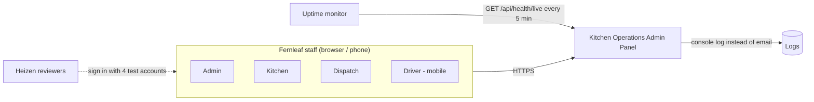
There are no external integrations (payments, accounting, email and recipes are out of scope).

## 3. Deployment view
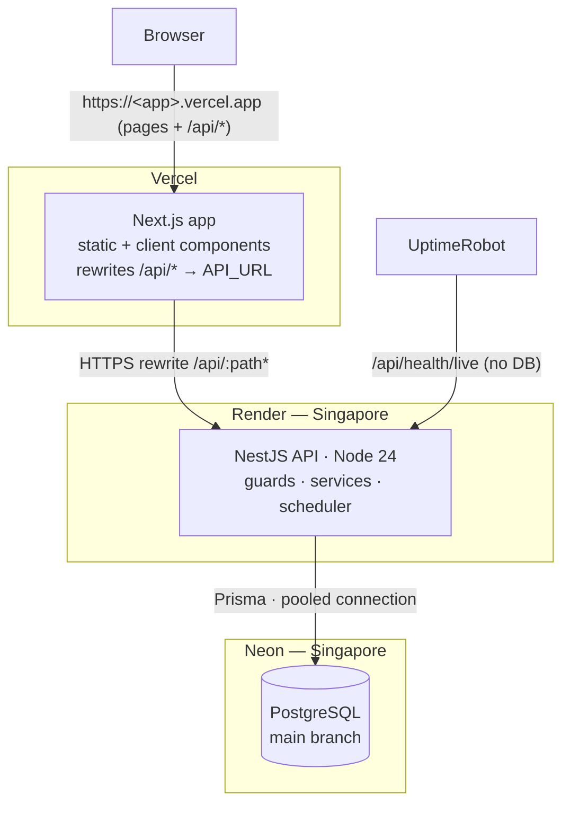
| Component | Platform | Notes |
|---|---|---|
| Web | Vercel (Hobby) | Root `apps/web`. Env `API_URL`. Function region set near India (`sin1`/`bom1`). |
| API | Render free web service, Singapore | `prisma migrate deploy` on start. Health check `/api/health/live`. Kept warm by the uptime monitor. |
| DB | Neon free, Singapore | `main` (prod), `dev` (local development), `test` (integration tests) branches |
| Keep-alive | UptimeRobot (5-min HTTP check) | The health endpoint doesn't touch the DB, so Neon can still auto-suspend |

## 4. Request path and trust boundaries
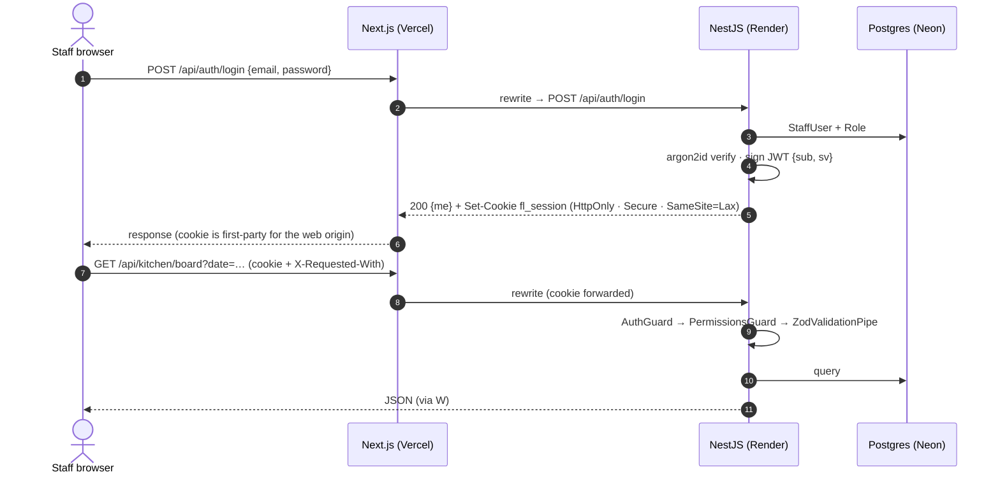
Trust boundary: **everything in the browser is untrusted**. The API re-validates every input, permission and scope. Navigation hiding in the UI is cosmetic only (ACC-03).

## 5. Monorepo structure
```
/
├─ apps/
│  ├─ api/
│  │  ├─ prisma/              schema.prisma · migrations/ · seed.ts
│  │  ├─ src/
│  │  │  ├─ main.ts · app.module.ts
│  │  │  ├─ config/           env schema (Zod) · typed ConfigService
│  │  │  ├─ common/
│  │  │  │  ├─ prisma/        PrismaService (single client, pooled)
│  │  │  │  ├─ clock/         ClockService (now, kitchen today; injectable for tests)
│  │  │  │  ├─ auth/          AuthGuard · PermissionsGuard · @RequirePermissions · @Public · @CurrentUser
│  │  │  │  ├─ errors/        DomainError types · global exception filter (envelope)
│  │  │  │  ├─ validation/    ZodValidationPipe
│  │  │  │  └─ http/          request-id · logging · compression · helmet
│  │  │  ├─ modules/
│  │  │  │  ├─ auth/  staff/  reference/  catalogue/  pricing/  menu/
│  │  │  │  ├─ companies/  employees/  ordering/  cutoff/  kitchen/
│  │  │  │  ├─ dispatch/  driver/  files/  billing/  settings/
│  │  │  │  └─ dashboard/  demo/  meta/
│  │  │  └─ generated/prisma/ (git-ignored)
│  │  └─ test/                API integration tests (Supertest)
│  └─ web/
│     └─ src/
│        ├─ app/
│        │  ├─ (auth)/login/
│        │  ├─ (app)/layout.tsx           AppShell: sidebar from route manifest, kitchen clock, AuthGate
│        │  ├─ (app)/dashboard/ orders/ kitchen/ dispatch/ catalogue/ menu/ pricing/
│        │  │      companies/ employees/ billing/ settings/ staff/ reference-data/
│        │  └─ (app)/driver/              phone-first page in the shared shell
│        ├─ features/<area>/              components · query & mutation hooks · forms
│        ├─ components/ui/                shadcn/ui primitives
│        ├─ components/common/            DataTable · PageHeader · StatusBadge · Money · KitchenTime · EmptyState
│        ├─ lib/                          api-client · query-client · auth · route-manifest · format
│        └─ proxy.ts (middleware)         redirect to /login when no session cookie (UX only)
├─ packages/
│  ├─ shared/src/   schemas/ (zod per area) · permissions.ts · errors.ts · enums.ts · format.ts
│  └─ domain/src/   money.ts · pricing.ts · menu.ts · combinations.ts · calendar.ts · schedule.ts · billing.ts (+ *.test.ts)
└─ docs/
```
Dependency direction: `web → shared`, `api → shared + domain`, `domain → (luxon only)`, `shared → (zod only)`. Nothing ever depends on an app.

## 6. Backend architecture

### 6.1 Layers inside a module
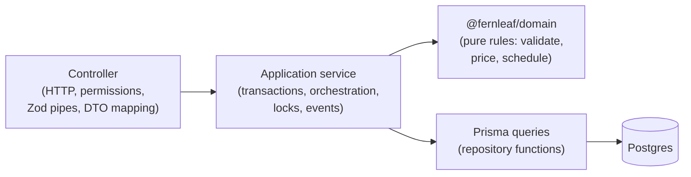
- **Controllers** are thin: they declare permissions, parse input with shared Zod schemas, and map results to DTOs.
- **Services** own transactions and call domain functions with plain data (rows mapped to domain inputs).
- **Domain** functions are pure and deterministic. Time is passed in, and they do no I/O, so they're trivially unit-testable.
- **Cross-module calls** go through exported services only, never through another module's Prisma queries.

### 6.2 Module map
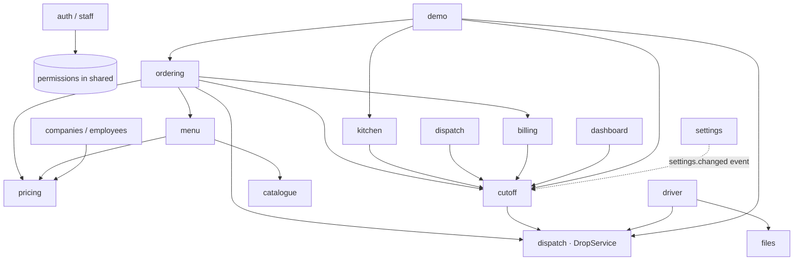
| Module | Owns |
|---|---|
| `auth`, `staff` | Login, sessions, `me`, staff CRUD, roles |
| `reference` | The five admin-managed lists (one generic implementation) |
| `catalogue` | Dishes, options, option groups, portions |
| `pricing` | Tiers, explicit prices, grid, resolution (wraps the domain) |
| `menu` | Categories and items, company visibility, the priced preview / resolved menu |
| `companies`, `employees` | Company profile, domains, addresses, calendar, defaults; employees, moves, CSV import |
| `ordering` | Context, calendar, quote, create, edit, place, cancel, reject, delivery overrides, list and detail, timeline |
| `cutoff` | Cut-off computation, processing, scheduler, lazy `ensureProcessed()`, console |
| `kitchen` | Board, production summary, unit transitions, force-complete |
| `dispatch` | Drops (`DropService`: attach, detach, transitions), driver assignment, dispatch board |
| `driver` | Today's own drops, picked-up, delivered with note and photo |
| `files` | `FileStore` (Postgres bytea implementation), authorised download |
| `billing` | Billable lists, invoices, payments, adjustments, credit on void |
| `settings` | Platform settings, kitchen holidays (emits `settings.changed`) |
| `dashboard` | One query function per documented figure (A1…R2) |
| `demo` | Base seed helpers, rolling generator, autopilot |
| `meta` | `/meta` (kitchen TZ, today, now) and health endpoints |

### 6.3 Request pipeline (cross-cutting)
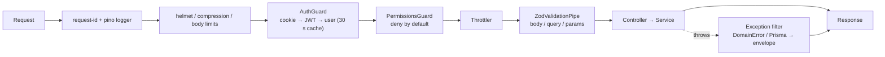

### 6.4 Transactions and concurrency
- Interactive Prisma transactions wrap every multi-row write. Row locks (`SELECT … FOR UPDATE`) and advisory locks are raw SQL inside them.
- Patterns are catalogued in [TRD §4.6](TRD.md#46-concurrency-nfr-03): compare-and-set status updates, an order-row lock for prep-unit changes, versioned order edits, a per-date advisory lock for cut-off, and unique constraints as the last line of defence.

### 6.5 Background work without a cron dependency
- `CutoffScheduler`: a 60-second **in-memory** check against `nextDueAt`. It only hits the DB when a cut-off is actually due.
- `ensureProcessed()`: lazy catch-up called by read and write paths, so statuses can't be stale even if the process slept.
- `DemoService`: on boot, daily at 00:05 IST, and lazily on the first request of a new kitchen day.
- Single API instance (Render free). In-memory state is a cache, never the source of truth.

## 7. Frontend architecture
- **Route manifest** (`lib/route-manifest.ts`): `{ path, label, icon, permission, group }`. It drives the sidebar, the client-side route guard and the "not allowed" page. One source, so navigation and guards can't drift apart.
- **Providers:** `QueryClientProvider` → `AuthProvider` (`/api/auth/me`) → `KitchenClockProvider` (`/api/meta`; offset between server time and browser time).
- **Data:** TanStack Query hooks per feature (`useOrders(filters)`, `useKitchenBoard(date, station)`, `useMarkUnitDone()`…). Query keys are namespaced by area. Boards poll (15 s), the driver view every 30 s, dashboards every 60 s.
- **Mutations:** optimistic for kitchen and dispatch actions, rolled back on 409 with the server's message.
- **Forms:** react-hook-form + zodResolver using the **same** schemas the API validates with. Server errors map onto fields by path.
- **Order configurator:** nested field arrays (lines → combinations → selections). Live breakdown from `POST /api/orders/quote`, so the browser never does price maths.
- **Driver area:** `/driver` inside the shared app shell (the shell collapses to a top bar + menu sheet on phones, so drivers keep their dashboard link). Phone-first page: one column, 48 px primary buttons, a bottom sheet for "Mark delivered", on-device image compression (longest side 1600 px, JPEG 80 %).
- **Formatting:** money from cents through `formatCents`. Times through `formatKitchen(iso)` with the kitchen zone. The UI never derives "today" from the browser clock.

## 8. Shared contracts
| Package | Exports | Used by |
|---|---|---|
| `@fernleaf/shared` | Zod schemas (request and response per endpoint) · inferred TS types · `PERMISSIONS` catalogue + descriptions · `ErrorCode` union · enums mirrored from Prisma · `formatCents`, `formatOrderNumber`, time helpers for display | web + api |
| `@fernleaf/domain` | `resolvePrice`, `buildTierGrid`, `resolveMenu`, `isOrderable`, `validateLines`, `priceOrder`, `deliveryDayStatus`, `cutoffAt`, `isLocked`, `latestLockedDate`, `plannedTimes`, `unitRisk`, `dropRisk`, `isOnTime`, `netBilled`, `cancellationCredit`, `assertCreditAllowed` | api (and web only for display helpers, if needed) |

## 9. Key flows

### 9.1 Place an order (ORD-01, ORD-02)
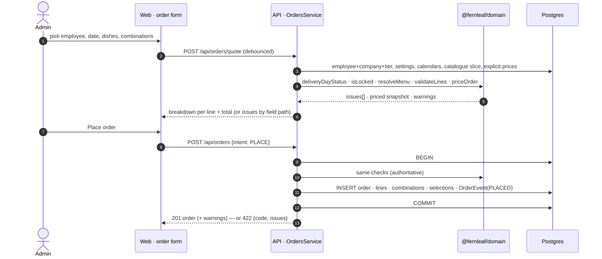

### 9.2 Cut-off processing (CUT-03…05)
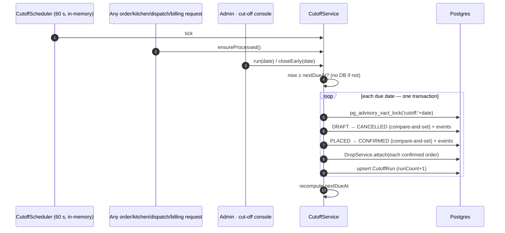
A re-run finds no DRAFT or PLACED rows and only increments `runCount`. That's idempotent by construction.

### 9.3 Two cooks finish the same unit (KIT-05, NFR-03)
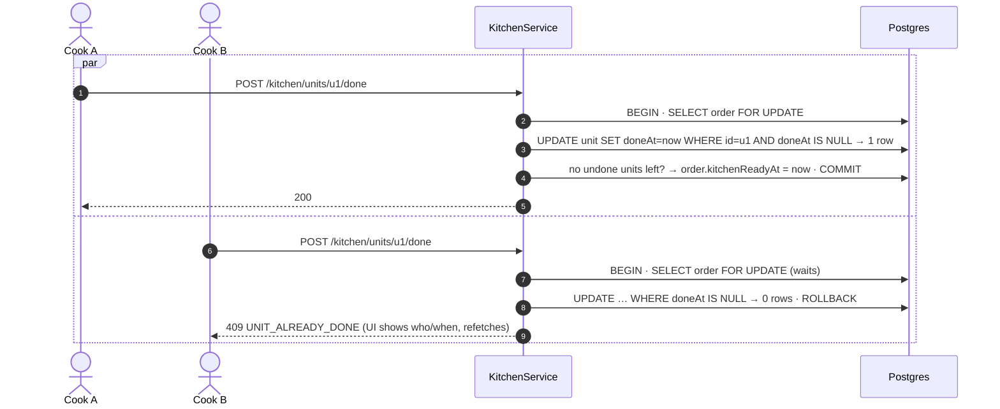

### 9.4 Drop to delivered (DSP-01…09)
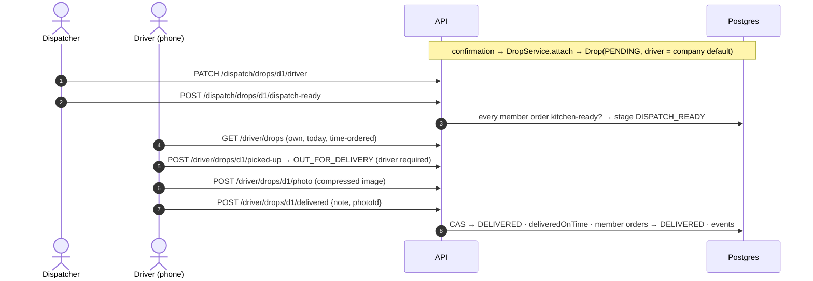

### 9.5 Invoicing (BIL-02…06)
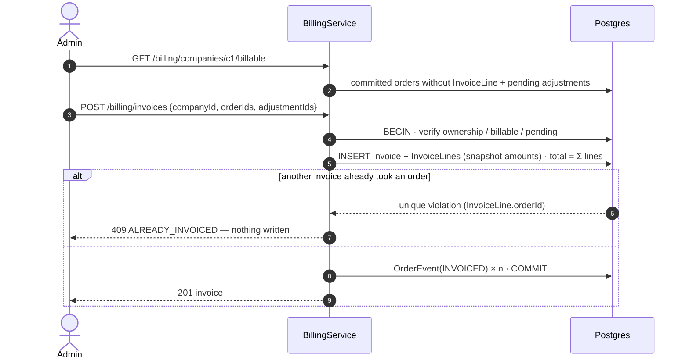

## 10. Time model (NFR-02)
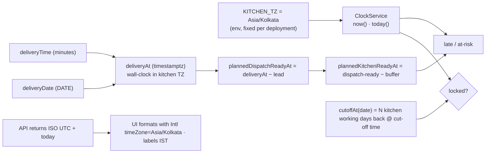
The server's process TZ and the browser's TZ never enter any calculation.

## 11. Access-control model (ACC-03, ACC-04)
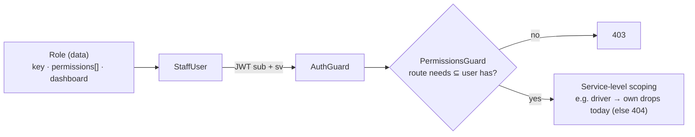
Code references **permissions only**. Adding a role is a data change (TRD §4.8).

## 12. Quality attributes
| Attribute | Architectural answer |
|---|---|
| Correctness of rules | Pure domain package with tests. DB constraints for invariants. The server is the single authority (the quote endpoint shares code with writes). |
| Money exactness | Integer cents and basis points end to end. Snapshots on orders and invoices. Totals reconciled. |
| Time-zone safety | One clock service. DATE / minutes / timestamptz split. Explicit-zone formatting. TZ-matrix tests. |
| Concurrency | CAS updates, row and advisory locks, versions, unique constraints |
| Security | Server-side permissions (deny by default), scoping, httpOnly session, CSRF header, validation everywhere |
| Performance | Indexed hot paths, single-query boards, pagination, gzip, list virtualisation |
| Availability (review) | Keep-alive, DB-quiet idle, rolling demo data, health endpoints |
| Maintainability | Module boundaries, shared contracts, consistent error envelope, lint and typecheck in CI |
| Extensibility | Roles as data. Persisted drops and units. FileStore interface. See DB doc §10. |

## 13. Key decisions and trade-offs (public summary; README uses this)
| # | Decision | Why | Trade-off accepted |
|---|---|---|---|
| D1 | Monorepo (pnpm + Turborepo) with shared Zod contracts | Types and validation shared by web and API (NFR-06) | Slightly more build plumbing (tsup for packages) |
| D2 | Browser → same-origin `/api` → Next rewrite → NestJS, with an httpOnly cookie session | No CORS, no third-party cookies, secure session | One extra network hop through Vercel |
| D3 | Permission-based RBAC, roles as data | New roles without code changes (ACC-04) | The permission catalogue must be kept tidy |
| D4 | Business rules in a pure `domain` package | Testable, framework-free, reused by quote and write | Rows must be mapped into domain inputs |
| D5 | Effective prices computed on read, snapshotted on orders | Nothing to keep in sync, so derived prices can't go stale | The grid computes per request (cheap at this scale) |
| D6 | A combination row **is** the prep unit | No duplicated kitchen state, no sync bugs | Kitchen timestamps live on an order-content table |
| D7 | Drops persisted with a natural unique key | A real entity for driver, note, photo and on-time | Membership maintenance on delivery overrides |
| D8 | Cut-off processing idempotent and lock-serialised, triggered by scheduler + lazily + manually | Correct even if the process slept. Reviewers can trigger it. | A cheap in-memory check on read paths |
| D9 | Immutable invoices, with changes as adjustments on the next invoice | Accounting-correct and history-safe (BIL-06) | An invoice can contain credit lines besides orders |
| D10 | Integer cents and basis-point multipliers | Exact money and rounding (NFR-01) | Formatting only at the edges |
| D11 | One kitchen TZ per deployment (Asia/Kolkata). DATE / minutes / timestamptz. | Correct regardless of server or browser TZ (NFR-02) | Multi-kitchen would need a `Kitchen` entity |
| D12 | Delivery photos in Postgres behind a `FileStore` interface | No extra service or account. Trivial to swap for S3/R2. | DB growth at scale |
| D13 | Client-side data fetching (TanStack Query), no server actions | Keeps all logic in the API (PLT-02). Easy polling and optimistic UI. | No server-rendered data (fine for an internal tool) |
| D14 | Rolling demo data generated through real domain code | The app is alive on any review day (PLT-06/07) | Demo code ships in prod (behind `DEMO_DATA_ENABLED`) |
| D15 | Vercel + Render + Neon free tiers, DB-quiet keep-alive | Free, two-week uptime, fast enough | Render free CPU is modest. Cold start avoided by pinging. |
