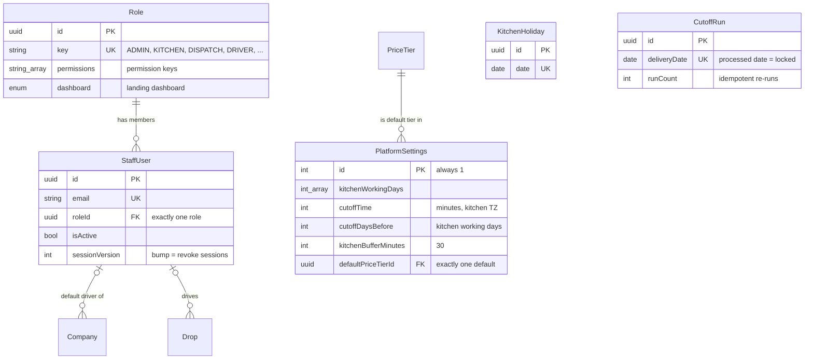
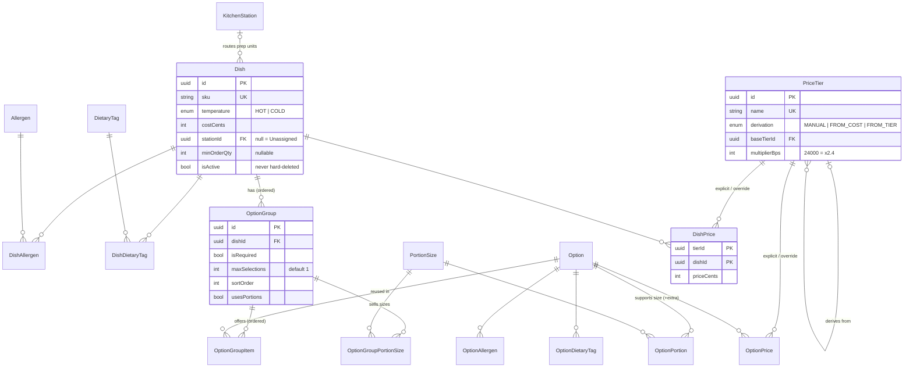
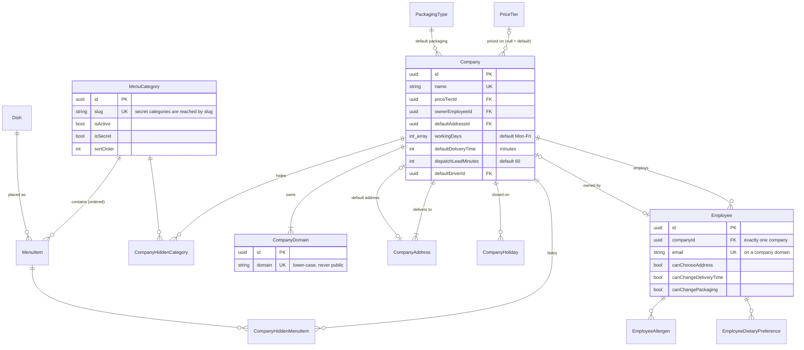
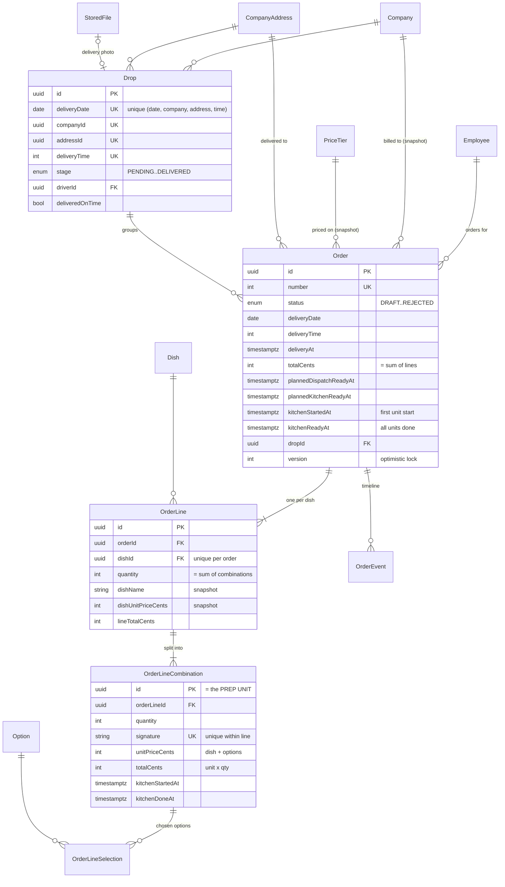
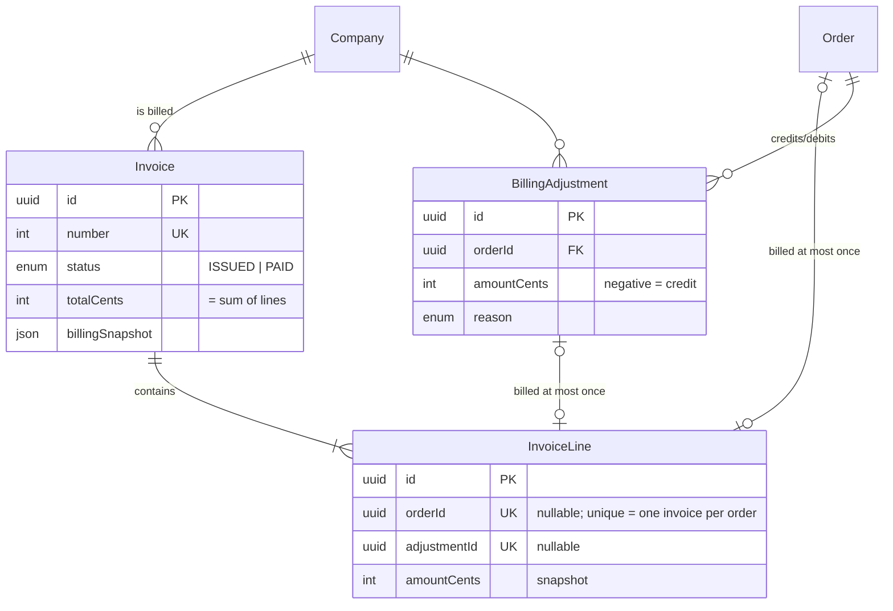

# Database Models — Fernleaf Kitchen Operations Admin Panel

| Field | Value |
|---|---|
| Version | 1.0 (baseline), 2026-10-03 |
| Database | PostgreSQL (Neon), accessed through Prisma |
| Implements | [PRD](PRD.md) · [TRD](TRD.md) |
| Status | Draft schema v1. Phase 1 validates it with `prisma validate` and the first migration. Changes must update this file. |

---

## 1. Modelling principles

1. **The data model is the business.** Every concept the brief names gets its own table: price tier, option group, combination, prep unit, drop, cut-off run, invoice, adjustment. Nothing is hidden inside JSON blobs.
2. **Rules live as low as possible.** Where a rule can be a constraint (uniqueness, one invoice per order, one drop per key, non-negative money, "done implies started"), the database enforces it. Rules that need context live in pure domain functions (`packages/domain`). Services orchestrate.
3. **History is immutable.** Orders store **snapshots** of names and prices at capture time, and invoices store snapshots of amounts. Catalogue and price edits never rewrite the past (CAT-12, PRICE-08).
4. **Nothing referenced is hard-deleted.** Dishes, options, reference rows, addresses and staff are deactivated (`isActive`). Join rows and configuration may be deleted.
5. **Money is integer cents. Calendar dates are `DATE`. Times of day are minutes. Instants are `timestamptz`.** There are no floats and no "midnight UTC means a date" ambiguity.
6. **Roles are data.** Permissions are code constants stored on the role row, so a new role needs no migration and no code change.
7. **Built to survive the next requirement.** See §10.

## 2. Conventions

| Topic | Convention |
|---|---|
| Primary keys | `id String @id @default(uuid(7)) @db.Uuid`: time-ordered UUIDv7 |
| Human numbers | `Order.number`, `Invoice.number`: `Int @unique @default(autoincrement())`, displayed `FL-000123` / `INV-0042` |
| Money | `Int` cents, field suffix `Cents`. Multipliers in basis points (`multiplierBps`, 10 000 = ×1). |
| Calendar dates | `DateTime @db.Date`. In code, only the `dbDate('YYYY-MM-DD')` / `fromDbDate(d)` helpers are used. |
| Times of day | `Int` minutes after midnight, kitchen-local (0–1439). The API shows `"HH:mm"`. |
| Instants | `DateTime @db.Timestamptz(3)` |
| Weekday sets | `Int[]` of ISO weekdays (1 = Mon … 7 = Sun) |
| Emails and domains | Stored lower-case (CHECK constraint). Unique. |
| Timestamps | `createdAt @default(now())`, `updatedAt @updatedAt` on mutable aggregates |
| Actors | `…ById String? @db.Uuid`. A real FK only where we join for display (order creator, event actor, drop driver, company default driver). `NULL` = system / demo data. |
| Naming | Prisma model names in PascalCase, singular. Tables keep Prisma's default quoted names. |

## 3. Entity–relationship diagrams

### 3.1 Access, settings, calendar


### 3.2 Catalogue and pricing


### 3.3 Menu, companies, employees


### 3.4 Orders, kitchen, dispatch


### 3.5 Billing


## 4. Entity catalogue

### 4.1 Access and platform
| Entity | Purpose | Key invariants |
|---|---|---|
| `Role` | A named bundle of permission keys plus a landing dashboard | `key` unique. `permissions` validated against the code catalogue on write. Seeded roles have `isSystem = true`. |
| `StaffUser` | A person who signs in to the panel | Exactly one role. Email unique and lower-case. Deactivated users can't sign in. Bumping `sessionVersion` revokes sessions. |
| `PlatformSettings` | Singleton of platform-wide values (SET-01) | `id = 1` (CHECK). `defaultPriceTierId` NOT NULL, so there is **exactly one default tier**. Value ranges are CHECKed. |
| `KitchenHoliday` | Days the kitchen is closed | Unique date. Used by cut-off counting and by delivery-day validation. |
| `CutoffRun` | Record that a delivery date's cut-off was processed | Unique date. Its existence locks the date (A-05). `runCount` shows idempotent re-runs. |

### 4.2 Reference data (admin-managed lists)
`Allergen`, `DietaryTag`, `KitchenStation`, `PortionSize`, `PackagingType`. Each has a unique name, `sortOrder` and `isActive`. Rows that are referenced can't be deleted, only deactivated.

### 4.3 Catalogue
| Entity | Purpose | Key invariants |
|---|---|---|
| `Dish` | A sellable meal | SKU unique. `costCents ≥ 0`. `minOrderQty ≥ 1` when set. `stationId` NULL = "Unassigned". Never hard-deleted. |
| `Option` | A reusable choice (paneer, jeera rice, raita) | Own cost, allergens, tags, tier prices. Never hard-deleted. |
| `OptionGroup` | A dish's choice ("Choose your protein") | Belongs to one dish. `isRequired`, `maxSelections ≥ 1`, `sortOrder`, `usesPortions`. Group name unique within the dish. |
| `OptionGroupItem` | Ordered option membership of a group | PK (group, option), so an option appears at most once per group |
| `OptionGroupPortionSize` | Sizes a portion-enabled group sells | Only meaningful when `usesPortions = true` (validated on save) |
| `OptionPortion` | An option supports a size, with a flat `extraCents` | Every option in a portion group must have a row for each of the group's sizes (A-11, validated on save) |

### 4.4 Pricing
| Entity | Purpose | Key invariants |
|---|---|---|
| `PriceTier` | A named price list with an optional derivation rule | Shape CHECK: MANUAL has neither a base nor a multiplier. FROM_COST has a multiplier. FROM_TIER has a base ≠ self and a multiplier. Acyclic chain (service). |
| `DishPrice` / `OptionPrice` | Explicit price on a tier: the price itself for MANUAL tiers, an **override** for derived tiers | PK (tier, item). Dish price > 0 and option price ≥ 0 (CHECK). |

Effective prices are **computed on read** (`resolvePrice`, TRD §5.2). They are never stored, so there is nothing to keep in sync, and they are snapshotted onto orders at capture time.

### 4.5 Menu
| Entity | Purpose | Key invariants |
|---|---|---|
| `MenuCategory` | Ordered, activatable grouping. May be **secret**. | `slug` unique (direct link for secret categories) |
| `MenuItem` | A dish's placement in a category | Unique (category, dish). Own `isActive` and `sortOrder`. |
| `CompanyHiddenCategory` / `CompanyHiddenMenuItem` | Per-company hiding (MENU-02) | PK pairs. Hidden beats secret (domain rule). |

### 4.6 Companies and employees
| Entity | Purpose | Key invariants |
|---|---|---|
| `Company` | Client organisation and billing party | Name unique. Tier optional (NULL = default). Owner is an employee of the company (service). `defaultAddressId` is one of its active addresses (service). `workingDays` default Mon–Fri. Lead minutes default 60. Default packaging required. |
| `CompanyDomain` | Email domain claimed by a company | **Globally unique**, lower-case, not on the public-domain list (service, from settings) |
| `CompanyAddress` | Delivery address | Belongs to one company. Deactivated, never deleted once used. |
| `CompanyHoliday` | Company closure day | Unique (company, date) |
| `Employee` | The customer: belongs to exactly one company | Email unique and on one of the company's domains. Three permission flags. Allergies and diets through join tables. |

### 4.7 Orders and kitchen
| Entity | Purpose | Key invariants |
|---|---|---|
| `Order` | One employee's boxed-meal order for one delivery date | Status machine (TRD §7.1). `companyId` and `priceTierId` are **snapshots** of the context at ordering. `totalCents = Σ lines`. Planned times stored and recomputed on delivery-time change. `version` for optimistic locking. `createdById` NULL = demo/system. |
| `OrderLine` | One dish on the order | Unique (order, dish). `quantity = Σ combinations`. Dish name, SKU, temperature, unit price and unit cost are snapshots. |
| `OrderLineCombination` | One distinct option combination with a quantity. **This row is the kitchen prep unit.** | Unique (line, signature). `totalCents = unitPriceCents × quantity` (CHECK). Kitchen timestamps follow "done ⇒ started" (CHECK). |
| `OrderLineSelection` | One chosen option (and portion) within a combination | Group, option and portion names plus prices are snapshots. `optionGroupId` is set to NULL if the group configuration is later removed. |
| `OrderEvent` | Append-only order timeline (ORD-07) | Type, time, actor (NULL = system), JSON detail (e.g. before/after of an override) |

### 4.8 Dispatch and files
| Entity | Purpose | Key invariants |
|---|---|---|
| `Drop` | Orders for the same company, address and **exact** delivery time, handled together | Unique (date, company, address, time). Stage machine with timestamp CHECKs. Out for delivery requires a driver (CHECK). On-time recorded once. |
| `StoredFile` | Uploaded bytes (delivery photos; dish images later) | Kind, MIME type, size. Accessed through the `FileStore` interface. |

### 4.9 Billing
| Entity | Purpose | Key invariants |
|---|---|---|
| `Invoice` | Internal invoice record for one company | `totalCents = Σ lines` (service, tested). Immutable except `ISSUED → PAID`. Billing contact snapshotted. |
| `InvoiceLine` | An order **or** an adjustment on an invoice, with a snapshot amount | **`orderId` UNIQUE, so an order is on at most one invoice** (BIL-05). `adjustmentId` UNIQUE. Exactly one of the two (CHECK). |
| `BillingAdjustment` | A credit (< 0) or debit (> 0) against an order. Created automatically on cancel/reject after invoicing, or manually (short delivery). | Pending until it is put on an invoice line. Net credits ≤ billed amount (domain). |

### 4.10 Demo support
| Entity | Purpose |
|---|---|
| `DemoDay` | Marker that the rolling demo generator already produced a date's orders (makes generation idempotent per date) |

## 5. Snapshot and lifecycle rules
| What changes later | What is protected | How |
|---|---|---|
| Dish or option renamed, re-priced, re-costed | Past order lines | Name, SKU, temperature, unit price and unit cost are copied onto `OrderLine` / `OrderLineSelection` at capture |
| Price tier rules or overrides | Placed or confirmed orders | Prices captured at placement. Unchanged lines keep their capture on edit (A-08). |
| Company moves to another tier, or an employee moves company | Existing orders | `Order.companyId` and `Order.priceTierId` are captured at ordering. Billing follows the order. |
| Address edited | Delivered history | `Order.addressSnapshot` (formatted text) captured at placement and on override |
| Option group removed from a dish | Old selections | `OrderLineSelection.groupName` snapshot. The FK is set to NULL. |
| Settings changed (cut-off, buffer, grace) | Processed dates, recorded on-time results | `CutoffRun` locks processed dates. `deliveredOnTime` is stored. Planned times are stored. |
| Invoiced order cancelled or shortened | The issued invoice | The invoice is immutable. The change becomes a `BillingAdjustment` billed on the next invoice. |

Deletion policy: no hard deletes for `Dish`, `Option`, `StaffUser`, `Company` (with orders), `CompanyAddress` (with orders), or reference rows in use. Join and configuration rows (`MenuItem`, `OptionGroupItem`, hidden rows, holidays, explicit prices) may be deleted.

## 6. Indexes and query patterns
Postgres doesn't index foreign keys automatically, so every FK we filter or join on is indexed explicitly (composite unique keys also serve as indexes on their leading columns).

| Query | Index used |
|---|---|
| Order list by delivery-date range + status (+ company) | `Order(deliveryDate, status)`, `Order(status, deliveryDate)`, `Order(companyId, deliveryDate)` |
| Orders of an employee | `Order(employeeId, deliveryDate)` |
| Kitchen board for a date | `Order(deliveryDate, status)` → `OrderLine(orderId, …)` (unique prefix) → `OrderLineCombination(orderLineId, …)` (unique prefix) |
| Cut-off processing for a date | `Order(deliveryDate, status)` |
| Drops for a date / for a driver today | `Drop(deliveryDate, stage)`, `Drop(deliveryDate, driverId)` |
| Orders in a drop | `Order(dropId)` |
| Uninvoiced billable orders for a company | `Order(companyId, deliveryDate)` + anti-join on `InvoiceLine(orderId)` (unique) |
| Order timeline | `OrderEvent(orderId, at)` |
| Tier grid | `DishPrice(tierId, dishId)` PK, `DishPrice(dishId)` |
| Employee search in a company | `Employee(companyId, name)`. Email is unique. |

At the brief's scale (400 orders per day, ~1 600 prep units), every hot path is one or two indexed queries.

## 7. Constraints added by hand in migration SQL
Prisma's schema language can't express CHECK constraints, so they're appended to the first migration (`migrate dev --create-only`, then edit). Prisma Migrate leaves them alone afterwards.

```sql
-- Singleton settings
ALTER TABLE "PlatformSettings" ADD CONSTRAINT "PlatformSettings_singleton" CHECK ("id" = 1);
ALTER TABLE "PlatformSettings" ADD CONSTRAINT "PlatformSettings_ranges" CHECK (
  "cutoffTime" BETWEEN 0 AND 1439 AND "cutoffDaysBefore" BETWEEN 0 AND 14
  AND "kitchenBufferMinutes" BETWEEN 0 AND 240 AND "atRiskMinutes" BETWEEN 0 AND 240
  AND "onTimeGraceMinutes" BETWEEN 0 AND 120
  AND "deliveryWindowStart" BETWEEN 0 AND 1439 AND "deliveryWindowEnd" BETWEEN 0 AND 1439
  AND "deliveryWindowStart" < "deliveryWindowEnd");

-- Money and quantity sanity
ALTER TABLE "Dish"        ADD CONSTRAINT "Dish_cost_nonneg"      CHECK ("costCents" >= 0);
ALTER TABLE "Dish"        ADD CONSTRAINT "Dish_moq_positive"     CHECK ("minOrderQty" IS NULL OR "minOrderQty" >= 1);
ALTER TABLE "Option"      ADD CONSTRAINT "Option_cost_nonneg"    CHECK ("costCents" >= 0);
ALTER TABLE "DishPrice"   ADD CONSTRAINT "DishPrice_positive"    CHECK ("priceCents" > 0);
ALTER TABLE "OptionPrice" ADD CONSTRAINT "OptionPrice_nonneg"    CHECK ("priceCents" >= 0);
ALTER TABLE "OptionPortion" ADD CONSTRAINT "OptionPortion_extra_nonneg" CHECK ("extraCents" >= 0);
ALTER TABLE "OptionGroup" ADD CONSTRAINT "OptionGroup_max_positive" CHECK ("maxSelections" >= 1);
ALTER TABLE "Order"       ADD CONSTRAINT "Order_total_nonneg"    CHECK ("totalCents" >= 0);
ALTER TABLE "OrderLine"   ADD CONSTRAINT "OrderLine_qty_positive" CHECK ("quantity" >= 1);
ALTER TABLE "OrderLineCombination" ADD CONSTRAINT "OLC_qty_positive"  CHECK ("quantity" >= 1);
ALTER TABLE "OrderLineCombination" ADD CONSTRAINT "OLC_total_matches" CHECK ("totalCents" = "unitPriceCents" * "quantity");

-- Kitchen unit integrity: done implies started, and not before it
ALTER TABLE "OrderLineCombination" ADD CONSTRAINT "OLC_done_implies_started" CHECK (
  "kitchenDoneAt" IS NULL OR ("kitchenStartedAt" IS NOT NULL AND "kitchenDoneAt" >= "kitchenStartedAt"));

-- Times of day
ALTER TABLE "Order"   ADD CONSTRAINT "Order_time_range"   CHECK ("deliveryTime" BETWEEN 0 AND 1439);
ALTER TABLE "Drop"    ADD CONSTRAINT "Drop_time_range"    CHECK ("deliveryTime" BETWEEN 0 AND 1439);
ALTER TABLE "Company" ADD CONSTRAINT "Company_time_range" CHECK (
  "defaultDeliveryTime" BETWEEN 0 AND 1439 AND "dispatchLeadMinutes" BETWEEN 0 AND 600);

-- Tier derivation shape (cycles beyond self are rejected by the service)
ALTER TABLE "PriceTier" ADD CONSTRAINT "PriceTier_derivation_shape" CHECK (
     ("derivation" = 'MANUAL'    AND "baseTierId" IS NULL     AND "multiplierBps" IS NULL)
  OR ("derivation" = 'FROM_COST' AND "baseTierId" IS NULL     AND "multiplierBps" > 0)
  OR ("derivation" = 'FROM_TIER' AND "baseTierId" IS NOT NULL AND "baseTierId" <> "id" AND "multiplierBps" > 0));

-- Drop stage consistency
ALTER TABLE "Drop" ADD CONSTRAINT "Drop_stage_consistency" CHECK (
     "stage" = 'PENDING'
  OR ("stage" = 'DISPATCH_READY'   AND "dispatchReadyAt" IS NOT NULL)
  OR ("stage" = 'OUT_FOR_DELIVERY' AND "outForDeliveryAt" IS NOT NULL AND "driverId" IS NOT NULL)
  OR ("stage" = 'DELIVERED'        AND "deliveredAt" IS NOT NULL AND "deliveredOnTime" IS NOT NULL));

-- An invoice line bills exactly one thing
ALTER TABLE "InvoiceLine" ADD CONSTRAINT "InvoiceLine_exactly_one_target" CHECK (num_nonnulls("orderId", "adjustmentId") = 1);

-- Normalised identifiers
ALTER TABLE "StaffUser"     ADD CONSTRAINT "StaffUser_email_lower"   CHECK ("email" = lower("email"));
ALTER TABLE "Employee"      ADD CONSTRAINT "Employee_email_lower"    CHECK ("email" = lower("email"));
ALTER TABLE "CompanyDomain" ADD CONSTRAINT "CompanyDomain_lower"     CHECK ("domain" = lower("domain"));
```

> We deliberately avoid hand-written **indexes** (e.g. partial unique indexes), because a later `migrate dev` diff may try to drop indexes it doesn't know about. "Exactly one default" is modelled structurally instead (`PlatformSettings.defaultPriceTierId`, `Company.defaultAddressId`).

## 8. Prisma schema (draft v1)

```prisma
// apps/api/prisma/schema.prisma — Fernleaf Kitchen
// Conventions: UUIDv7 ids · money = Int cents (*Cents) · calendar dates = DATE · time of day = Int minutes
// after midnight in kitchen TZ (Asia/Kolkata) · instants = timestamptz(3). See docs/DATABASE_MODELS.md.

generator client {
  provider     = "prisma-client"            // Prisma 7 generator ("prisma-client-js" if pinned to 6.x)
  output       = "../src/generated/prisma"
  moduleFormat = "cjs"                      // NestJS compiles to CommonJS
}

datasource db {
  provider = "postgresql"
  // Prisma 7: URLs configured in prisma.config.ts (DATABASE_URL pooled, DIRECT_URL for migrations)
  // Prisma 6: url = env("DATABASE_URL") and directUrl = env("DIRECT_URL")
}

// ───────────────────────────── Enums ─────────────────────────────

enum DashboardKind {
  ADMIN
  KITCHEN
  DISPATCH
  DRIVER
}

enum Temperature {
  HOT
  COLD
}

enum TierDerivation {
  MANUAL    // every price typed in
  FROM_COST // price = ceil5(cost × multiplier)
  FROM_TIER // price = ceil5(base tier's effective price × multiplier)
}

enum OrderStatus {
  DRAFT
  PLACED
  CONFIRMED
  DELIVERED
  CANCELLED
  REJECTED
}

enum OrderEventType {
  CREATED
  UPDATED
  PLACED
  CONFIRMED
  CANCELLED
  REJECTED
  KITCHEN_STARTED
  KITCHEN_READY
  KITCHEN_FORCE_COMPLETED
  DELIVERY_CHANGED
  DROP_ASSIGNED
  DRIVER_ASSIGNED
  DISPATCH_READY
  OUT_FOR_DELIVERY
  DELIVERED
  INVOICED
  ADJUSTMENT_ADDED
}

enum DropStage {
  PENDING
  DISPATCH_READY
  OUT_FOR_DELIVERY
  DELIVERED
}

enum CutoffTrigger {
  SCHEDULED   // in-process timer at the computed cut-off instant
  ON_DEMAND   // lazily, before a read/write touching a past-cut-off date
  MANUAL      // admin console, past cut-off
  CLOSE_EARLY // admin console, future date closed early (A-06)
}

enum InvoiceStatus {
  ISSUED
  PAID
}

enum AdjustmentReason {
  CANCELLED_AFTER_INVOICE
  REJECTED_AFTER_INVOICE
  SHORT_DELIVERY
  PRICE_CORRECTION
  OTHER
}

enum FileKind {
  DELIVERY_PHOTO
  DISH_IMAGE
}

// ───────────────────────── Access control ─────────────────────────

model Role {
  id          String        @id @default(uuid(7)) @db.Uuid
  key         String        @unique // stable identifier (ADMIN, KITCHEN, ...) — never used in code checks
  name        String
  description String        @default("")
  permissions String[] // permission keys from @fernleaf/shared
  dashboard   DashboardKind // landing dashboard after sign-in
  isSystem    Boolean       @default(false)
  createdAt   DateTime      @default(now()) @db.Timestamptz(3)
  updatedAt   DateTime      @updatedAt @db.Timestamptz(3)

  staff StaffUser[]
}

model StaffUser {
  id             String    @id @default(uuid(7)) @db.Uuid
  email          String    @unique // lower-case
  name           String
  phone          String?
  passwordHash   String // argon2id
  roleId         String    @db.Uuid
  isActive       Boolean   @default(true)
  sessionVersion Int       @default(0) // bump to revoke all sessions
  lastLoginAt    DateTime? @db.Timestamptz(3)
  createdAt      DateTime  @default(now()) @db.Timestamptz(3)
  updatedAt      DateTime  @updatedAt @db.Timestamptz(3)

  role             Role         @relation(fields: [roleId], references: [id])
  defaultDriverFor Company[]    @relation("CompanyDefaultDriver")
  drops            Drop[]       @relation("DropDriver")
  ordersCreated    Order[]      @relation("OrderCreatedBy")
  orderEvents      OrderEvent[]

  @@index([roleId])
}

// ───────────────────────── Reference data ─────────────────────────

model Allergen {
  id        String  @id @default(uuid(7)) @db.Uuid
  name      String  @unique
  sortOrder Int     @default(0)
  isActive  Boolean @default(true)

  dishes    DishAllergen[]
  options   OptionAllergen[]
  employees EmployeeAllergen[]
}

model DietaryTag {
  id        String  @id @default(uuid(7)) @db.Uuid
  name      String  @unique
  sortOrder Int     @default(0)
  isActive  Boolean @default(true)

  dishes    DishDietaryTag[]
  options   OptionDietaryTag[]
  employees EmployeeDietaryPreference[]
}

model KitchenStation {
  id        String  @id @default(uuid(7)) @db.Uuid
  name      String  @unique
  sortOrder Int     @default(0)
  isActive  Boolean @default(true)

  dishes Dish[]
}

model PortionSize {
  id        String  @id @default(uuid(7)) @db.Uuid
  name      String  @unique
  sortOrder Int     @default(0)
  isActive  Boolean @default(true)

  groupSizes     OptionGroupPortionSize[]
  optionPortions OptionPortion[]
  selections     OrderLineSelection[]
}

model PackagingType {
  id          String  @id @default(uuid(7)) @db.Uuid
  name        String  @unique
  description String  @default("")
  sortOrder   Int     @default(0)
  isActive    Boolean @default(true)

  companies Company[]
  orders    Order[]
}

// ─────────────────────────── Catalogue ───────────────────────────

model Dish {
  id          String      @id @default(uuid(7)) @db.Uuid
  sku         String      @unique // internal SKU number, e.g. FL-BWL-001
  name        String
  description String      @default("")
  imageUrl    String?
  temperature Temperature
  costCents   Int // cost price (hand-entered)
  stationId   String?     @db.Uuid // null → "Unassigned" on the kitchen board
  minOrderQty Int? // per order line (A-22)
  isActive    Boolean     @default(true) // deactivate, never delete (CAT-02)
  createdAt   DateTime    @default(now()) @db.Timestamptz(3)
  updatedAt   DateTime    @updatedAt @db.Timestamptz(3)

  station      KitchenStation?  @relation(fields: [stationId], references: [id])
  allergens    DishAllergen[]
  dietaryTags  DishDietaryTag[]
  optionGroups OptionGroup[]
  menuItems    MenuItem[]
  prices       DishPrice[]
  orderLines   OrderLine[]

  @@index([isActive])
  @@index([stationId])
}

model DishAllergen {
  dishId     String @db.Uuid
  allergenId String @db.Uuid

  dish     Dish     @relation(fields: [dishId], references: [id], onDelete: Cascade)
  allergen Allergen @relation(fields: [allergenId], references: [id])

  @@id([dishId, allergenId])
  @@index([allergenId])
}

model DishDietaryTag {
  dishId       String @db.Uuid
  dietaryTagId String @db.Uuid

  dish       Dish       @relation(fields: [dishId], references: [id], onDelete: Cascade)
  dietaryTag DietaryTag @relation(fields: [dietaryTagId], references: [id])

  @@id([dishId, dietaryTagId])
  @@index([dietaryTagId])
}

model Option {
  id          String   @id @default(uuid(7)) @db.Uuid
  name        String   @unique
  description String   @default("")
  costCents   Int
  isActive    Boolean  @default(true)
  createdAt   DateTime @default(now()) @db.Timestamptz(3)
  updatedAt   DateTime @updatedAt @db.Timestamptz(3)

  allergens   OptionAllergen[]
  dietaryTags OptionDietaryTag[]
  prices      OptionPrice[]
  portions    OptionPortion[]
  groupItems  OptionGroupItem[]
  selections  OrderLineSelection[]
}

model OptionAllergen {
  optionId   String @db.Uuid
  allergenId String @db.Uuid

  option   Option   @relation(fields: [optionId], references: [id], onDelete: Cascade)
  allergen Allergen @relation(fields: [allergenId], references: [id])

  @@id([optionId, allergenId])
  @@index([allergenId])
}

model OptionDietaryTag {
  optionId     String @db.Uuid
  dietaryTagId String @db.Uuid

  option     Option     @relation(fields: [optionId], references: [id], onDelete: Cascade)
  dietaryTag DietaryTag @relation(fields: [dietaryTagId], references: [id])

  @@id([optionId, dietaryTagId])
  @@index([dietaryTagId])
}

model OptionGroup {
  id            String  @id @default(uuid(7)) @db.Uuid
  dishId        String  @db.Uuid
  name          String // "Choose your protein"
  isRequired    Boolean @default(false)
  maxSelections Int     @default(1) // single-choice by default (A-10)
  sortOrder     Int     @default(0)
  usesPortions  Boolean @default(false) // [Should] portions (A-11)

  dish         Dish                     @relation(fields: [dishId], references: [id], onDelete: Cascade)
  items        OptionGroupItem[]
  portionSizes OptionGroupPortionSize[]
  selections   OrderLineSelection[]

  @@unique([dishId, name])
  @@index([dishId, sortOrder])
}

model OptionGroupItem {
  groupId   String @db.Uuid
  optionId  String @db.Uuid
  sortOrder Int    @default(0)

  group  OptionGroup @relation(fields: [groupId], references: [id], onDelete: Cascade)
  option Option      @relation(fields: [optionId], references: [id])

  @@id([groupId, optionId])
  @@index([optionId])
}

model OptionGroupPortionSize {
  groupId       String @db.Uuid
  portionSizeId String @db.Uuid
  sortOrder     Int    @default(0)

  group       OptionGroup @relation(fields: [groupId], references: [id], onDelete: Cascade)
  portionSize PortionSize @relation(fields: [portionSizeId], references: [id])

  @@id([groupId, portionSizeId])
}

model OptionPortion {
  optionId      String @db.Uuid
  portionSizeId String @db.Uuid
  extraCents    Int    @default(0) // flat surcharge on top of the option's tier price

  option      Option      @relation(fields: [optionId], references: [id], onDelete: Cascade)
  portionSize PortionSize @relation(fields: [portionSizeId], references: [id])

  @@id([optionId, portionSizeId])
}

// ──────────────────────────── Pricing ────────────────────────────

model PriceTier {
  id            String         @id @default(uuid(7)) @db.Uuid
  name          String         @unique // Standard, Enterprise, Partner, ...
  description   String         @default("")
  derivation    TierDerivation @default(MANUAL)
  baseTierId    String?        @db.Uuid // FROM_TIER only
  multiplierBps Int? // ×10 000: 24000 = cost × 2.4, 11500 = +15 %
  createdAt     DateTime       @default(now()) @db.Timestamptz(3)
  updatedAt     DateTime       @updatedAt @db.Timestamptz(3)

  baseTier     PriceTier?         @relation("TierDerivedFrom", fields: [baseTierId], references: [id])
  derivedTiers PriceTier[]        @relation("TierDerivedFrom")
  dishPrices   DishPrice[]
  optionPrices OptionPrice[]
  companies    Company[]
  orders       Order[]
  defaultFor   PlatformSettings[] @relation("DefaultPriceTier")
}

/// Explicit dish price on a tier: the price itself on MANUAL tiers, an override on derived tiers.
model DishPrice {
  tierId     String   @db.Uuid
  dishId     String   @db.Uuid
  priceCents Int
  updatedAt  DateTime @updatedAt @db.Timestamptz(3)

  tier PriceTier @relation(fields: [tierId], references: [id], onDelete: Cascade)
  dish Dish      @relation(fields: [dishId], references: [id], onDelete: Cascade)

  @@id([tierId, dishId])
  @@index([dishId])
}

model OptionPrice {
  tierId     String   @db.Uuid
  optionId   String   @db.Uuid
  priceCents Int
  updatedAt  DateTime @updatedAt @db.Timestamptz(3)

  tier   PriceTier @relation(fields: [tierId], references: [id], onDelete: Cascade)
  option Option    @relation(fields: [optionId], references: [id], onDelete: Cascade)

  @@id([tierId, optionId])
  @@index([optionId])
}

// ───────────────────────────── Menu ─────────────────────────────

model MenuCategory {
  id          String   @id @default(uuid(7)) @db.Uuid
  name        String
  slug        String   @unique // direct link; how secret categories are reached
  description String   @default("")
  sortOrder   Int      @default(0)
  isActive    Boolean  @default(true)
  isSecret    Boolean  @default(false) // not listed, still reachable (MENU-03)
  createdAt   DateTime @default(now()) @db.Timestamptz(3)
  updatedAt   DateTime @updatedAt @db.Timestamptz(3)

  items     MenuItem[]
  hiddenFor CompanyHiddenCategory[]

  @@index([sortOrder])
}

model MenuItem {
  id         String  @id @default(uuid(7)) @db.Uuid
  categoryId String  @db.Uuid
  dishId     String  @db.Uuid
  sortOrder  Int     @default(0)
  isActive   Boolean @default(true)

  category  MenuCategory            @relation(fields: [categoryId], references: [id], onDelete: Cascade)
  dish      Dish                    @relation(fields: [dishId], references: [id])
  hiddenFor CompanyHiddenMenuItem[]

  @@unique([categoryId, dishId])
  @@index([dishId])
}

model CompanyHiddenCategory {
  companyId  String @db.Uuid
  categoryId String @db.Uuid

  company  Company      @relation(fields: [companyId], references: [id], onDelete: Cascade)
  category MenuCategory @relation(fields: [categoryId], references: [id], onDelete: Cascade)

  @@id([companyId, categoryId])
  @@index([categoryId])
}

model CompanyHiddenMenuItem {
  companyId  String @db.Uuid
  menuItemId String @db.Uuid

  company  Company  @relation(fields: [companyId], references: [id], onDelete: Cascade)
  menuItem MenuItem @relation(fields: [menuItemId], references: [id], onDelete: Cascade)

  @@id([companyId, menuItemId])
  @@index([menuItemId])
}

// ─────────────────────── Companies & employees ───────────────────────

model Company {
  id                     String   @id @default(uuid(7)) @db.Uuid
  name                   String   @unique
  priceTierId            String?  @db.Uuid // null → default tier (PRICE-04)
  ownerEmployeeId        String?  @unique @db.Uuid // must be one of its employees (service)
  defaultAddressId       String?  @unique @db.Uuid // must be one of its active addresses (service)
  billingContactName     String
  billingEmail           String
  billingPhone           String?
  billingAddress         String   @default("")
  workingDays            Int[]    @default([1, 2, 3, 4, 5]) // ISO weekdays, default Mon–Fri
  defaultDeliveryTime    Int // minutes after midnight, kitchen TZ (e.g. 750 = 12:30)
  dispatchLeadMinutes    Int      @default(60) // order must leave the kitchen this long before delivery
  defaultPackagingTypeId String   @db.Uuid
  driverInstructions     String   @default("") // standing instructions for the driver
  defaultDriverId        String?  @db.Uuid
  createdAt              DateTime @default(now()) @db.Timestamptz(3)
  updatedAt              DateTime @updatedAt @db.Timestamptz(3)

  priceTier            PriceTier?      @relation(fields: [priceTierId], references: [id])
  owner                Employee?       @relation("CompanyOwner", fields: [ownerEmployeeId], references: [id])
  defaultAddress       CompanyAddress? @relation("CompanyDefaultAddress", fields: [defaultAddressId], references: [id])
  defaultPackagingType PackagingType   @relation(fields: [defaultPackagingTypeId], references: [id])
  defaultDriver        StaffUser?      @relation("CompanyDefaultDriver", fields: [defaultDriverId], references: [id])

  domains          CompanyDomain[]
  addresses        CompanyAddress[]        @relation("CompanyAddresses")
  holidays         CompanyHoliday[]
  employees        Employee[]              @relation("EmployeeCompany")
  hiddenCategories CompanyHiddenCategory[]
  hiddenMenuItems  CompanyHiddenMenuItem[]
  orders           Order[]
  drops            Drop[]
  invoices         Invoice[]
  adjustments      BillingAdjustment[]
}

model CompanyDomain {
  id        String   @id @default(uuid(7)) @db.Uuid
  companyId String   @db.Uuid
  domain    String   @unique // lower-case, globally unique, never a public domain (COMP-02)
  createdAt DateTime @default(now()) @db.Timestamptz(3)

  company Company @relation(fields: [companyId], references: [id], onDelete: Cascade)

  @@index([companyId])
}

model CompanyAddress {
  id            String   @id @default(uuid(7)) @db.Uuid
  companyId     String   @db.Uuid
  label         String // "HQ – Tower B, 4th floor"
  line1         String
  line2         String?
  city          String
  state         String?
  postalCode    String
  country       String   @default("India")
  deliveryNotes String   @default("")
  isActive      Boolean  @default(true)
  createdAt     DateTime @default(now()) @db.Timestamptz(3)
  updatedAt     DateTime @updatedAt @db.Timestamptz(3)

  company     Company  @relation("CompanyAddresses", fields: [companyId], references: [id], onDelete: Cascade)
  defaultOf   Company? @relation("CompanyDefaultAddress")
  orders      Order[]
  drops       Drop[]

  @@index([companyId])
}

model CompanyHoliday {
  id        String   @id @default(uuid(7)) @db.Uuid
  companyId String   @db.Uuid
  date      DateTime @db.Date
  name      String

  company Company @relation(fields: [companyId], references: [id], onDelete: Cascade)

  @@unique([companyId, date])
}

model Employee {
  id                    String   @id @default(uuid(7)) @db.Uuid
  companyId             String   @db.Uuid // exactly one company (EMP-01)
  name                  String
  email                 String   @unique // lower-case, on one of the company's domains (A-18)
  phone                 String?
  canChooseAddress      Boolean  @default(false)
  canChangeDeliveryTime Boolean  @default(false)
  canChangePackaging    Boolean  @default(false)
  createdAt             DateTime @default(now()) @db.Timestamptz(3)
  updatedAt             DateTime @updatedAt @db.Timestamptz(3)

  company      Company                     @relation("EmployeeCompany", fields: [companyId], references: [id])
  ownerOf      Company?                    @relation("CompanyOwner")
  allergens    EmployeeAllergen[]
  dietaryPrefs EmployeeDietaryPreference[]
  orders       Order[]

  @@index([companyId, name])
}

model EmployeeAllergen {
  employeeId String @db.Uuid
  allergenId String @db.Uuid

  employee Employee @relation(fields: [employeeId], references: [id], onDelete: Cascade)
  allergen Allergen @relation(fields: [allergenId], references: [id])

  @@id([employeeId, allergenId])
  @@index([allergenId])
}

model EmployeeDietaryPreference {
  employeeId   String @db.Uuid
  dietaryTagId String @db.Uuid

  employee   Employee   @relation(fields: [employeeId], references: [id], onDelete: Cascade)
  dietaryTag DietaryTag @relation(fields: [dietaryTagId], references: [id])

  @@id([employeeId, dietaryTagId])
  @@index([dietaryTagId])
}

// ───────────────────── Settings, calendar, cut-off ─────────────────────

model PlatformSettings {
  id                   Int      @id @default(1) // singleton (CHECK id = 1)
  kitchenWorkingDays   Int[]    @default([1, 2, 3, 4, 5]) // live data uses all 7 days (A-03)
  cutoffTime           Int      @default(960) // 16:00
  cutoffDaysBefore     Int      @default(2) // kitchen working days
  kitchenBufferMinutes Int      @default(30) // kitchen-ready = dispatch-ready − this
  atRiskMinutes        Int      @default(30)
  onTimeGraceMinutes   Int      @default(0)
  deliveryWindowStart  Int      @default(420) // 07:00
  deliveryWindowEnd    Int      @default(1260) // 21:00
  defaultPriceTierId   String   @db.Uuid // exactly one default tier (PRICE-02)
  publicEmailDomains   String[] // gmail.com, yahoo.com, outlook.com, ...
  updatedAt            DateTime @updatedAt @db.Timestamptz(3)
  updatedById          String?  @db.Uuid

  defaultPriceTier PriceTier @relation("DefaultPriceTier", fields: [defaultPriceTierId], references: [id])
}

model KitchenHoliday {
  id   String   @id @default(uuid(7)) @db.Uuid
  date DateTime @unique @db.Date
  name String
}

/// A processed cut-off. Existence locks the delivery date (A-05); re-runs only bump runCount (CUT-04).
model CutoffRun {
  id             String        @id @default(uuid(7)) @db.Uuid
  deliveryDate   DateTime      @unique @db.Date
  cutoffAt       DateTime      @db.Timestamptz(3) // cut-off instant as computed at processing time
  firstRunAt     DateTime      @default(now()) @db.Timestamptz(3)
  lastRunAt      DateTime      @default(now()) @db.Timestamptz(3)
  runCount       Int           @default(1)
  trigger        CutoffTrigger
  triggeredById  String?       @db.Uuid
  confirmedCount Int           @default(0) // cumulative across runs
  cancelledCount Int           @default(0)
}

// ─────────────────────── Orders & kitchen ───────────────────────

model Order {
  id                     String      @id @default(uuid(7)) @db.Uuid
  number                 Int         @unique @default(autoincrement()) // FL-000123
  status                 OrderStatus @default(DRAFT)
  employeeId             String      @db.Uuid
  companyId              String      @db.Uuid // billing party, captured at ordering
  priceTierId            String      @db.Uuid // tier used for pricing, captured
  deliveryDate           DateTime    @db.Date // kitchen-local calendar date
  deliveryTime           Int // minutes after midnight, kitchen TZ
  deliveryAt             DateTime    @db.Timestamptz(3) // instant = date + time in kitchen TZ
  addressId              String      @db.Uuid
  addressSnapshot        String // formatted address at placement/override
  packagingTypeId        String      @db.Uuid
  notes                  String      @default("")
  totalCents             Int         @default(0) // = Σ OrderLine.lineTotalCents
  dispatchLeadMinutes    Int // company setting captured on the order
  plannedDispatchReadyAt DateTime    @db.Timestamptz(3) // deliveryAt − dispatchLeadMinutes
  plannedKitchenReadyAt  DateTime    @db.Timestamptz(3) // plannedDispatchReadyAt − kitchen buffer
  placedAt               DateTime?   @db.Timestamptz(3)
  confirmedAt            DateTime?   @db.Timestamptz(3)
  cancelledAt            DateTime?   @db.Timestamptz(3)
  rejectedAt             DateTime?   @db.Timestamptz(3)
  deliveredAt            DateTime?   @db.Timestamptz(3)
  statusReason           String? // why cancelled / rejected
  kitchenStartedAt       DateTime?   @db.Timestamptz(3) // first unit's start (KIT-07)
  kitchenReadyAt         DateTime?   @db.Timestamptz(3) // set only when every unit is done
  kitchenForced          Boolean     @default(false) // admin force-complete (KIT-11)
  dropId                 String?     @db.Uuid // set once confirmed
  version                Int         @default(0) // optimistic concurrency
  createdById            String?     @db.Uuid // null = system / demo data
  createdAt              DateTime    @default(now()) @db.Timestamptz(3)
  updatedAt              DateTime    @updatedAt @db.Timestamptz(3)

  employee      Employee       @relation(fields: [employeeId], references: [id])
  company       Company        @relation(fields: [companyId], references: [id])
  priceTier     PriceTier      @relation(fields: [priceTierId], references: [id])
  address       CompanyAddress @relation(fields: [addressId], references: [id])
  packagingType PackagingType  @relation(fields: [packagingTypeId], references: [id])
  drop          Drop?          @relation(fields: [dropId], references: [id], onDelete: SetNull)
  createdBy     StaffUser?     @relation("OrderCreatedBy", fields: [createdById], references: [id])

  lines       OrderLine[]
  events      OrderEvent[]
  invoiceLine InvoiceLine?
  adjustments BillingAdjustment[]

  @@index([deliveryDate, status])
  @@index([status, deliveryDate])
  @@index([companyId, deliveryDate])
  @@index([employeeId, deliveryDate])
  @@index([dropId])
}

model OrderLine {
  id                 String      @id @default(uuid(7)) @db.Uuid
  orderId            String      @db.Uuid
  dishId             String      @db.Uuid
  quantity           Int // = Σ combination quantities (CAT-08)
  dishName           String // snapshot
  dishSku            String // snapshot
  dishTemperature    Temperature // snapshot
  dishUnitPriceCents Int // snapshot: dish price on the order's tier at capture
  dishUnitCostCents  Int // snapshot: cost at capture
  lineTotalCents     Int // = Σ combination totals
  sortOrder          Int         @default(0)
  pricedAt           DateTime    @db.Timestamptz(3) // when prices were captured

  order        Order                  @relation(fields: [orderId], references: [id], onDelete: Cascade)
  dish         Dish                   @relation(fields: [dishId], references: [id])
  combinations OrderLineCombination[]

  @@unique([orderId, dishId]) // one line per dish per order (A-09)
  @@index([dishId])
}

/// One distinct option combination of a line — and the kitchen PREP UNIT (CAT-11, KIT-01).
model OrderLineCombination {
  id                 String    @id @default(uuid(7)) @db.Uuid
  orderLineId        String    @db.Uuid
  quantity           Int
  signature          String // canonical "groupId:optionId:portionId|…" ("" when the dish has no groups)
  label              String // snapshot, e.g. "Brown rice · Paneer (Large)"
  unitPriceCents     Int // dish unit price + Σ (option price + portion extra)
  unitCostCents      Int
  totalCents         Int // = unitPriceCents × quantity (CHECK)
  kitchenStartedAt   DateTime? @db.Timestamptz(3)
  kitchenStartedById String?   @db.Uuid
  kitchenDoneAt      DateTime? @db.Timestamptz(3) // done ⇒ started (CHECK)
  kitchenDoneById    String?   @db.Uuid

  orderLine  OrderLine            @relation(fields: [orderLineId], references: [id], onDelete: Cascade)
  selections OrderLineSelection[]

  @@unique([orderLineId, signature])
}

model OrderLineSelection {
  id                   String  @id @default(uuid(7)) @db.Uuid
  combinationId        String  @db.Uuid
  optionGroupId        String? @db.Uuid // null if the group config was later removed
  optionId             String  @db.Uuid
  portionSizeId        String? @db.Uuid
  groupName            String // snapshot
  optionName           String // snapshot
  portionName          String? // snapshot
  optionUnitPriceCents Int // snapshot: option price on the tier
  portionExtraCents    Int     @default(0) // snapshot
  unitCostCents        Int // snapshot

  combination OrderLineCombination @relation(fields: [combinationId], references: [id], onDelete: Cascade)
  optionGroup OptionGroup?         @relation(fields: [optionGroupId], references: [id], onDelete: SetNull)
  option      Option               @relation(fields: [optionId], references: [id])
  portionSize PortionSize?         @relation(fields: [portionSizeId], references: [id])

  @@index([combinationId])
  @@index([optionId])
}

/// Append-only order timeline (ORD-07). Not a general audit log (A-36).
model OrderEvent {
  id      String         @id @default(uuid(7)) @db.Uuid
  orderId String         @db.Uuid
  type    OrderEventType
  at      DateTime       @default(now()) @db.Timestamptz(3)
  actorId String?        @db.Uuid // null = system (cut-off, demo autopilot)
  data    Json? // e.g. { reason }, { before, after }

  order Order      @relation(fields: [orderId], references: [id], onDelete: Cascade)
  actor StaffUser? @relation(fields: [actorId], references: [id])

  @@index([orderId, at])
}

// ────────────────────────── Dispatch ──────────────────────────

/// Orders for the same company, address and exact delivery time, handled together (DSP-03).
model Drop {
  id               String    @id @default(uuid(7)) @db.Uuid
  deliveryDate     DateTime  @db.Date
  companyId        String    @db.Uuid
  addressId        String    @db.Uuid
  deliveryTime     Int
  deliveryAt       DateTime  @db.Timestamptz(3)
  stage            DropStage @default(PENDING)
  driverId         String?   @db.Uuid // defaults to the company's default driver on creation
  dispatchReadyAt  DateTime? @db.Timestamptz(3)
  outForDeliveryAt DateTime? @db.Timestamptz(3)
  deliveredAt      DateTime? @db.Timestamptz(3)
  deliveredOnTime  Boolean? // recorded once (A-29)
  deliveredById    String?   @db.Uuid
  deliveryNote     String?
  photoId          String?   @unique @db.Uuid
  createdAt        DateTime  @default(now()) @db.Timestamptz(3)
  updatedAt        DateTime  @updatedAt @db.Timestamptz(3)

  company Company        @relation(fields: [companyId], references: [id])
  address CompanyAddress @relation(fields: [addressId], references: [id])
  driver  StaffUser?     @relation("DropDriver", fields: [driverId], references: [id])
  photo   StoredFile?    @relation(fields: [photoId], references: [id])
  orders  Order[]

  @@unique([deliveryDate, companyId, addressId, deliveryTime])
  @@index([deliveryDate, driverId])
  @@index([deliveryDate, stage])
}

model StoredFile {
  id          String   @id @default(uuid(7)) @db.Uuid
  kind        FileKind
  mimeType    String
  sizeBytes   Int
  data        Bytes // Postgres bytea behind the FileStore interface (A-35)
  createdById String?  @db.Uuid
  createdAt   DateTime @default(now()) @db.Timestamptz(3)

  drop Drop?
}

// ─────────────────────────── Billing ───────────────────────────

model Invoice {
  id               String        @id @default(uuid(7)) @db.Uuid
  number           Int           @unique @default(autoincrement()) // INV-0042
  companyId        String        @db.Uuid
  status           InvoiceStatus @default(ISSUED)
  issuedAt         DateTime      @default(now()) @db.Timestamptz(3)
  periodStart      DateTime?     @db.Date // min delivery date covered (informational)
  periodEnd        DateTime?     @db.Date
  totalCents       Int // = Σ lines (service + tests); may be negative (credit note, A-33)
  billingSnapshot  Json // billing contact at issue time
  notes            String        @default("")
  paidAt           DateTime?     @db.Timestamptz(3)
  paymentReference String?
  createdById      String?       @db.Uuid
  paidById         String?       @db.Uuid

  company Company       @relation(fields: [companyId], references: [id])
  lines   InvoiceLine[]

  @@index([companyId, status])
}

model InvoiceLine {
  id           String    @id @default(uuid(7)) @db.Uuid
  invoiceId    String    @db.Uuid
  orderId      String?   @unique @db.Uuid // an order is on at most one invoice (BIL-05)
  adjustmentId String?   @unique @db.Uuid // an adjustment is billed at most once
  description  String
  deliveryDate DateTime? @db.Date
  amountCents  Int // snapshot

  invoice    Invoice            @relation(fields: [invoiceId], references: [id], onDelete: Cascade)
  order      Order?             @relation(fields: [orderId], references: [id])
  adjustment BillingAdjustment? @relation(fields: [adjustmentId], references: [id])

  @@index([invoiceId])
}

/// Credit (< 0) or debit (> 0) against an order, billed on the company's next invoice (A-32).
model BillingAdjustment {
  id          String           @id @default(uuid(7)) @db.Uuid
  companyId   String           @db.Uuid
  orderId     String           @db.Uuid
  amountCents Int
  reason      AdjustmentReason
  note        String           @default("")
  createdById String?          @db.Uuid
  createdAt   DateTime         @default(now()) @db.Timestamptz(3)

  company     Company      @relation(fields: [companyId], references: [id])
  order       Order        @relation(fields: [orderId], references: [id])
  invoiceLine InvoiceLine?

  @@index([companyId])
  @@index([orderId])
}

// ───────────────────────── Demo support ─────────────────────────

/// Marks a date as generated by the rolling demo generator (idempotent per date, A-40).
model DemoDay {
  date        DateTime @id @db.Date
  generatedAt DateTime @default(now()) @db.Timestamptz(3)
  orderCount  Int      @default(0)
}
```

## 9. Derived values (computed, never stored)
| Value | Computed by | Inputs |
|---|---|---|
| Effective price of a dish or option on a tier | `domain.pricing.resolvePrice` | Tier rules, explicit prices, costs |
| An employee's menu | `domain.menu.resolveMenu` | Categories, items, hiding, prices |
| Is a date locked? | `domain.calendar.isLocked` | Settings, kitchen holidays, `CutoffRun` |
| Cut-off instant for a date | `domain.calendar.cutoffAt` | Settings, kitchen calendar, TZ |
| Unit status (not started / in progress / done) | from `kitchenStartedAt` / `kitchenDoneAt` | — |
| Late / at-risk | `domain.schedule.unitRisk` / `dropRisk` | Planned times, now, settings |
| Order "invoiced?" | existence of an `InvoiceLine` with that `orderId` | — |
| Net billed per order | `domain.billing.netBilled` | Invoice line amount + adjustments |

## 10. Built for the next requirement
| Likely next requirement | Why the model already copes |
|---|---|
| A new staff role (e.g. "Kitchen lead" who can force-complete) | Insert a `Role` row with permissions and a dashboard. No code changes (ACC-04). |
| Customer-facing ordering app | Orders already belong to employees and go through the same API and domain rules. Add employee auth to the existing tables. |
| Multiple delivery windows or meal services per day | Drops are keyed by exact time, and planned times are per order. Nothing assumes one delivery per day. |
| Prep batching across orders | Units are rows with their own state. A batch table can point at many combination rows. |
| Price history or "price effective from" dates | Explicit prices are rows. Add `effectiveFrom` to `DishPrice` without touching order snapshots. |
| Voiding or re-issuing invoices | Lines are separate rows with unique order references. Adding a `VOID` status plus releasing lines is additive. |
| S3 / R2 photo storage | `FileStore` interface. `StoredFile` gains a `storageKey` and drops `data`. |
| Several kitchens or time zones | Today the time zone is deployment-level. A `Kitchen` table would carry its TZ and calendar, and orders would reference it. The calendar functions already take the zone as a parameter. |
