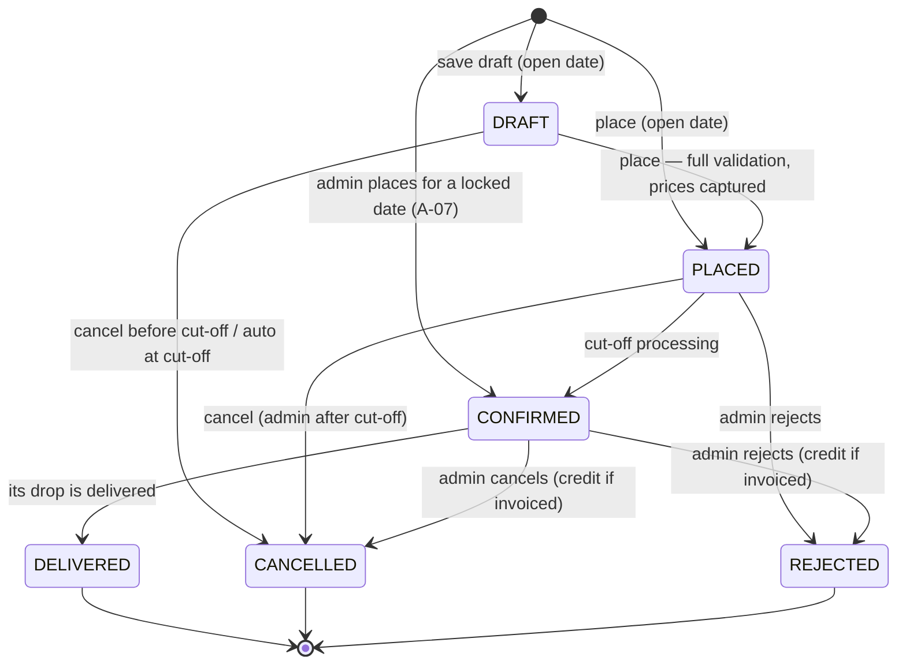
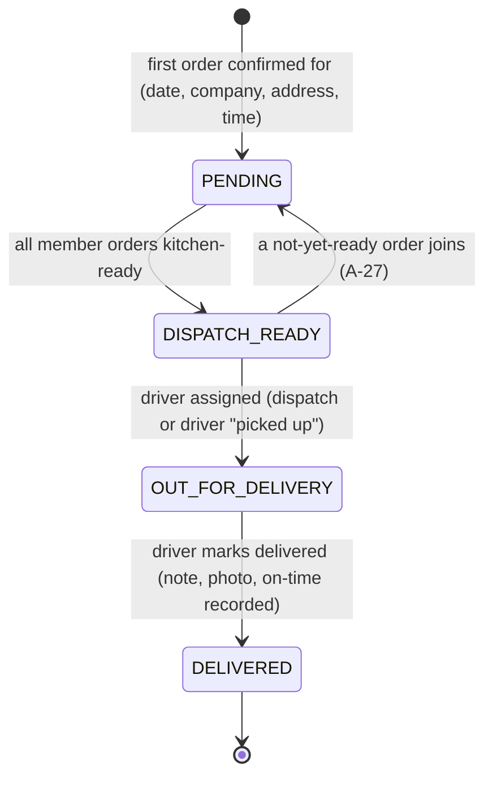

# Technical Requirements Document — Fernleaf Kitchen Operations Admin Panel

| Field | Value |
|---|---|
| Version | 1.0 (baseline), 2026-10-03 |
| Owner | Ayaan Goel |
| Implements | [PRD](PRD.md) v1.0 |
| Related | [Database models](DATABASE_MODELS.md) · [Architecture](ARCHITECTURE.md) |
| Status | Baseline for build. Deviations must be recorded here and in the decision log. |

---

## 1. Purpose

This document states **how** the PRD gets built: technology choices and why, cross-cutting conventions (money, time, errors, concurrency, security), the pure domain algorithms, the API surface per module, state machines, the business-rule enforcement matrix, and the testing, performance and deployment plan. Requirement IDs (e.g. `CUT-01`) and interpretation IDs (e.g. `A-14`) refer to the PRD.

## 2. Technology choices

| Layer | Choice | Why (defensible in review) | Considered |
|---|---|---|---|
| Language | TypeScript (strict) everywhere | One type system across web, API and shared contracts (NFR-06) | — |
| Runtime | Node.js 24 LTS | Installed locally (24.19). Supported by Render and Vercel. | — |
| Monorepo | **pnpm workspaces + Turborepo** | Strict dependency isolation, one lockfile, cached `build/lint/typecheck/test` task graph, shared packages without publishing | npm workspaces, Nx, separate repos |
| Frontend | **Next.js** (App Router, current major) + React 19 | Mandated. Layouts per area, file routing, good DX on Vercel. | — |
| UI | Tailwind CSS v4 + **shadcn/ui** (Radix) + lucide-react | Accessible primitives as owned code. Fast for dense admin UIs. | MUI, Mantine |
| Server state | **TanStack Query v5**, client-side, via same-origin `/api` | Caching, polling for live boards, optimistic updates with rollback. Keeps every rule in the API (PLT-02). | RSC data fetching (cookie forwarding, and it pulls logic into Next) |
| Forms | react-hook-form + `@hookform/resolvers/zod` | Handles the large nested order form well, and reuses the server's schemas | Formik |
| Tables | TanStack Table (server pagination) + TanStack Virtual for long boards | Headless, works with URL-driven filters | AG Grid |
| Charts | Recharts (shadcn chart wrappers), used sparingly | Small, honest charts (the brief values figures over charts) | — |
| Backend | **NestJS 11** (CommonJS) | Mandated. Modules, DI, guards, pipes, interceptors. NestJS 12 is ESM-only; 11 avoids ESM/decorator/tooling friction under the deadline. | NestJS 12 |
| Validation | **Zod 4** schemas in `packages/shared`, custom `ZodValidationPipe` | One definition for web and API, precise error paths | class-validator (duplicated definitions) |
| ORM | **Prisma 7.10** using the `prisma-client` generator with CJS output for Nest and the `@prisma/adapter-pg` driver adapter | Mandated | — |
| Database | **PostgreSQL** (Neon, region `ap-southeast-1` Singapore) | `DATE` and `timestamptz`, CHECK constraints, partial unique indexes, advisory locks, `SELECT … FOR UPDATE`, arrays | MySQL, SQLite |
| Time | **Luxon** | Explicit IANA-zone arithmetic, DST-safe wall-clock construction | date-fns-tz, Temporal polyfill |
| Auth | Email + password, **argon2id** (`@node-rs/argon2`), JWT (`@nestjs/jwt`) in an **httpOnly cookie** | Sessions owned by the API. No third-party dependency at review time. | Auth.js (puts auth logic in Next), Clerk |
| Scheduling | `@nestjs/schedule` interval timer that stays **DB-quiet** (§6.9) | Render runs a persistent process. Correctness doesn't depend on it (lazy processing). | External cron only |
| Logging | `nestjs-pino` (JSON logs, request ids) | Structured, cheap | winston |
| Tests | **Vitest** (`unplugin-swc` for Nest decorators) + Supertest | Fast, TS-native, one runner for all packages | Jest |
| Lint/format | ESLint 9 flat config + typescript-eslint, Prettier | "Lint and type-check cleanly" | Biome |
| CI | GitHub Actions: install → lint → typecheck → unit tests | The repo shows it stays green | — |
| Hosting | **Vercel** (web) · **Render** (API, Singapore, free) · **Neon** (DB, Singapore, free) · **UptimeRobot** (keep-alive) | Free tiers. Confirmed by owner on 2026-10-03. | Railway (paid), Fly.io |

> Exact versions are pinned by the scaffold in Phase 0 (lockfile) and listed in the README.

## 3. Repository layout and build

```
/                         pnpm-workspace.yaml · turbo.json · package.json · tsconfig.base.json · eslint.config.mjs · .env.example
├─ apps/
│  ├─ web/                @fernleaf/web — Next.js (UI only; no server actions; /api rewrite proxy)
│  └─ api/                @fernleaf/api — NestJS REST API, Prisma schema + migrations + seed
├─ packages/
│  ├─ shared/             @fernleaf/shared — Zod schemas, DTO types, permission catalogue, error codes, formatters
│  └─ domain/             @fernleaf/domain — pure business rules (money, calendar/cut-off, pricing, menu, combinations, billing)
└─ docs/                  PRD · TRD · DATABASE_MODELS · ARCHITECTURE
```

- Internal packages are built with **tsup** to `dist/` (CJS + ESM + `.d.ts`). Turborepo's `build` depends on `^build`.
- Root scripts: `dev` (web :3000 + api :4000), `build`, `lint`, `typecheck`, `test`, `db:migrate`, `db:seed`, `db:reset` (dev only).
- `packages/domain` depends on `luxon` only. It never imports Nest, Prisma or React.

## 4. Cross-cutting conventions

### 4.1 Money (NFR-01)
- **All amounts are integer cents.** Field names end in `Cents`. API payloads carry cents. The UI formats them only at render time (`Intl.NumberFormat('en-US', { style: 'currency', currency: 'USD' })`).
- **Multipliers are integer basis points** (`multiplierBps`, 10 000 = ×1): `24000` = cost × 2.4, `11500` = "+15 %", `9000` = "−10 %".
- **Derived price** = `ceilDiv(baseCents × bps, 50 000) × 5`. That is the exact value `baseCents × bps / 10 000` rounded **up** to a multiple of 5 cents. `ceilDiv` uses remainder arithmetic (`(a - a % b) / b + (a % b > 0 ? 1 : 0)`), so no float can creep in. Bounds are validated (price ≤ $100 000, bps ≤ 1 000 000) so every intermediate stays below 2⁵³.
- Totals: `combination.total = unitPrice × qty`, `line.total = Σ combinations`, `order.total = Σ lines`, `invoice.total = Σ lines`. They are computed by one domain function, stored, and asserted by reconciliation tests.

### 4.2 Time and calendars (NFR-02)
- `KITCHEN_TZ` env (default and production value **`Asia/Kolkata`**), validated at boot. Fixed per deployment, because changing it would reinterpret every stored date.
- Representations:

| Concept | API | DB | Notes |
|---|---|---|---|
| Calendar date (delivery date, holiday) | `"YYYY-MM-DD"` | `DATE` | Prisma surfaces it as a JS `Date` at 00:00 UTC. Always convert with `dbDate()` / `fromDbDate()`. Never use local getters. |
| Time of day (delivery time, cut-off time) | `"HH:mm"` | `INT` minutes after midnight (0–1439) | Kitchen-local wall-clock time |
| Instant (cut-off at, planned times, timestamps) | ISO-8601 UTC string | `timestamptz(3)` | |
| Weekday sets | `[1..7]` ISO (1 = Mon) | `INT[]` | |

- `ClockService` (API) is the only source of "now". `today()` = kitchen-TZ date of now. Tests inject a fixed clock.
- The browser never computes "today". It reads `today`/`now` from `GET /api/meta` (and board payloads), then formats instants with `Intl.DateTimeFormat(…, { timeZone: KITCHEN_TZ })` and labels them "IST".
- An ESLint `no-restricted-syntax` rule bans local-time getters (`getDate`, `getHours`, `getDay`, …) in `apps/api` and `packages/*`.
- Domain tests run under `TZ=UTC`, `TZ=America/Los_Angeles` and `TZ=Pacific/Kiritimati`. A passing run under all three shows the code ignores the process time zone.

### 4.3 Identifiers
- Primary keys: **UUIDv7** (`@default(uuid(7)) @db.Uuid`). They're time-ordered, index-friendly and not guessable.
- Human numbers: `Order.number` → `FL-000123`, `Invoice.number` → `INV-0042` (DB sequences, formatted in `shared`).
- `Dish.sku` is a unique string (e.g. `FL-BWL-001`). `MenuCategory.slug` is unique.

### 4.4 API style
- REST + JSON, global prefix **`/api`**, plural nouns, kebab-case paths, camelCase fields.
- Commands are sub-resources: `POST /api/orders/:id/place|cancel|reject`, `POST /api/kitchen/units/:id/start|done`.
- Pagination: `?page=1&pageSize=25` (max 100) → `{ items, page, pageSize, total }`.
- Filters are whitelisted, Zod-validated query params. Sorting: `sort=deliveryDate:desc` (whitelist).
- **Optimistic concurrency:** editable aggregates (Order) expose `version`. Updates must send it. A mismatch returns 409 `CONFLICT_STALE`.

### 4.5 Validation and the error model (NFR-04)
One error envelope for every failure:
```json
{
  "error": {
    "code": "COMBINATION_QTY_MISMATCH",
    "message": "Combination quantities must add up to the dish quantity (8 of 10 allocated).",
    "issues": [
      { "path": ["lines", 0, "combinations"], "code": "COMBINATION_QTY_MISMATCH", "message": "8 of 10 allocated" }
    ]
  },
  "requestId": "0192…"
}
```

| Layer | HTTP | Example codes |
|---|---|---|
| Shape validation (Zod) | 400 | `VALIDATION_FAILED` (issues come from Zod paths) |
| Authentication / authorisation | 401 / 403 | `UNAUTHENTICATED`, `FORBIDDEN` |
| Not found or out of scope | 404 | `NOT_FOUND` (also returned when a driver asks for someone else's drop, so existence isn't leaked) |
| State or concurrency conflict | 409 | `CONFLICT_STALE`, `INVALID_TRANSITION`, `UNIT_ALREADY_STARTED`, `UNIT_ALREADY_DONE`, `ALREADY_INVOICED`, `DROP_DEPARTED` |
| Business-rule violation | 422 | `CUTOFF_PASSED`, `DATE_NOT_DELIVERABLE`, `NOT_ON_MENU`, `PRICE_MISSING`, `COMBINATION_QTY_MISMATCH`, `REQUIRED_GROUP_MISSING`, `TOO_MANY_SELECTIONS`, `OPTION_NOT_IN_GROUP`, `OPTION_UNAVAILABLE`, `PORTION_INVALID`, `DUPLICATE_COMBINATION`, `DUPLICATE_DISH_LINE`, `BELOW_MIN_ORDER_QTY`, `DELIVERY_OPTION_NOT_ALLOWED`, `ADDRESS_INVALID`, `TIME_OUTSIDE_WINDOW`, `ORDER_NOT_CONFIRMED`, `DROP_NOT_READY`, `DRIVER_REQUIRED`, `ORDER_INVOICED`, `CREDIT_EXCEEDS_BILLED`, `DOMAIN_TAKEN`, `PUBLIC_DOMAIN`, `EMAIL_DOMAIN_MISMATCH`, `OWNER_NOT_EMPLOYEE`, `TIER_CYCLE`, `IN_USE` |
| Rate limit | 429 | `RATE_LIMITED` |
| Unexpected | 500 | `INTERNAL` (logged with the request id) |

- The API throws typed `DomainError`s (`RuleViolation`, `StateConflict`, `NotFound`, `Forbidden`). A global exception filter maps them, plus Prisma errors (`P2002` unique → 409 with a friendly message, `P2025` → 404), into the envelope.
- The domain layer collects **all** rule violations of a write (not just the first), so a form can show every problem at once.
- The web client turns envelopes into `ApiError`. `applyServerErrors(form, err)` maps `issues[].path` onto react-hook-form fields. Non-field errors become toasts.
- The error code catalogue lives in `packages/shared/src/errors.ts`, so both sides share it.

### 4.6 Concurrency (NFR-03)
Isolation level: Postgres default **READ COMMITTED**, plus the explicit mechanisms below. Interactive transactions use `prisma.$transaction(async tx => …)`. Row locks and advisory locks are raw SQL inside the transaction.

| Scenario | Mechanism | Loser sees |
|---|---|---|
| Two staff edit the same order | `UPDATE … WHERE id = $1 AND version = $2`, `version = version + 1` | 409 `CONFLICT_STALE` ("reload") |
| Status transitions (place, cancel, reject, confirm) | Compare-and-set: `UPDATE … WHERE status IN (allowed)` | 409 `INVALID_TRANSITION` |
| Two cooks mark the same unit done | `UPDATE "OrderLineCombination" SET "kitchenDoneAt" = now() … WHERE id = $1 AND "kitchenDoneAt" IS NULL` | 409 `UNIT_ALREADY_DONE` |
| Two units of one order finish at the same moment | Every unit transaction starts with `SELECT … FROM "Order" WHERE id = $1 FOR UPDATE`, which serialises per order, so `kitchenReadyAt` is set exactly once | — |
| Scheduler and manual cut-off run collide | `pg_advisory_xact_lock(hashtext('cutoff:' \|\| date))` + compare-and-set updates + `CutoffRun` upsert | No-op re-run |
| Two dispatchers advance the same drop | `UPDATE "Drop" … WHERE id = $1 AND stage = $expected` | 409 `INVALID_TRANSITION` |
| The same order is invoiced twice at once | `UNIQUE(InvoiceLine.orderId)`. The whole invoice transaction rolls back. | 409 `ALREADY_INVOICED` |
| Two transactions create the same drop | `UNIQUE(deliveryDate, companyId, addressId, deliveryTime)` + upsert | Joins the existing drop |

### 4.7 Authentication and sessions
- `POST /api/auth/login` verifies argon2id (OWASP baseline parameters), then signs a JWT `{ sub, sv }` (12 h; `sv` = the user's `sessionVersion`), then sets `fl_session` as **HttpOnly; Secure; SameSite=Lax; Path=/**.
- **Same-origin by design:** the browser only calls `https://<web>/api/*`. A Next.js `rewrites()` rule proxies that to the Render API, so the cookie is first-party for the web origin. There is no CORS and no third-party-cookie problem. *(Spike S1 in Phase 0 verifies `Set-Cookie` survives the Vercel rewrite. Fallback: Bearer token in memory + `sessionStorage`.)*
- A global `AuthGuard` verifies the JWT, loads the user and role (cached 30 s by `userId:sv`), and rejects inactive users or a stale `sv`. Then it attaches `req.user = { id, name, roleKey, permissions: Set, dashboard }`.
- Logout clears the cookie. Changing a user's role, deactivating them or resetting their password bumps `sessionVersion`, which kills their existing sessions.
- CSRF defence: SameSite=Lax, JSON-only mutations (multipart is only allowed on the photo endpoint), and a required `X-Requested-With: fetch` header on mutating requests.
- `@nestjs/throttler`: login 10/min per IP. Global 300/min per user.

### 4.8 Authorisation (ACC-03, ACC-04)
- **Permissions are code constants. Roles are data.** Code never checks role names.
- Every route declares `@RequirePermissions(...)`. A global `PermissionsGuard` **denies by default**: a route without metadata is forbidden unless it is marked `@Public()`.
- Record scoping lives in services: driver endpoints always filter by `req.user.id` and kitchen today. The file endpoint checks ownership.
- Landing dashboard = `Role.dashboard` (data). Drivers you can assign = active staff whose role has `deliveries.own`.

Permission catalogue (`packages/shared/src/permissions.ts`) and seeded role mapping:

| Permission | Meaning | Admin | Kitchen | Dispatch | Driver |
|---|---|:-:|:-:|:-:|:-:|
| `dashboard.view` | See own role's dashboard | ✓ | ✓ | ✓ | ✓ |
| `staff.read` / `staff.manage` | View / manage staff accounts and roles | ✓/✓ | | | |
| `reference.read` / `reference.manage` | Reference lists | ✓/✓ | ✓/– | | |
| `catalogue.read` / `catalogue.manage` | Dishes, options, groups, portions | ✓/✓ | ✓/– | | |
| `pricing.read` / `pricing.manage` | Tiers, prices, grid | ✓/✓ | | | |
| `menu.read` / `menu.manage` | Categories/items; `menu.manage` also covers the priced preview | ✓/✓ | ✓/– | | |
| `companies.read` / `companies.manage` | Companies and their settings | ✓/✓ | | ✓/– | |
| `employees.read` / `employees.manage` | Employees, moves, CSV import | ✓/✓ | | | |
| `orders.read` | Order list and detail | ✓ | ✓ | ✓ | |
| `orders.write` | Create, edit, place, cancel **before cut-off** | ✓ | | | |
| `orders.override` | After-cut-off edits, cancels and late orders; reject; delivery overrides | ✓ | | | |
| `cutoff.run` | Cut-off console and manual runs | ✓ | | | |
| `kitchen.read` / `kitchen.work` | Board and summary / start and done units | ✓/✓ | ✓/✓ | ✓/– | |
| `kitchen.forceComplete` | Force-complete an order | ✓ | | | |
| `dispatch.read` / `dispatch.manage` | Dispatch board / assign drivers and advance drops | ✓/✓ | | ✓/✓ | |
| `deliveries.own` | Own drops for today; makes the user assignable as a driver | | | | ✓ |
| `billing.read` / `billing.manage` | Billing, invoices, adjustments | ✓/✓ | | | |
| `settings.read` / `settings.manage` | Platform settings, kitchen holidays, demo refresh | ✓/✓ | | | |

> Adding a role (e.g. "Kitchen Lead" with `kitchen.forceComplete`) is one row: `{ key, name, permissions[], dashboard }`. No code changes.

### 4.9 Logging and observability
- JSON logs via pino, with a request id (`x-request-id`, generated if absent) echoed in responses and error envelopes.
- Domain events are logged at info: cut-off processed (date, confirmed, cancelled, trigger), invoice created, demo generation. Anywhere an email would be sent, it is logged to the console instead.
- `GET /api/health/live` (no DB; used by the uptime monitor) and `GET /api/health/ready` (`SELECT 1`).

### 4.10 Configuration (validated by Zod at boot; `.env.example` committed)
| App | Variable | Example / note |
|---|---|---|
| api | `NODE_ENV`, `PORT` | `production`, `4000` (Render injects `PORT`) |
| api | `DATABASE_URL` | Neon **pooled** connection string |
| api | `DIRECT_URL` | Neon direct connection (migrations) |
| api | `JWT_SECRET` | ≥ 32 random chars |
| api | `SESSION_TTL_HOURS` | `12` |
| api | `KITCHEN_TZ` | `Asia/Kolkata` |
| api | `COOKIE_SECURE` | `true` in prod, `false` on localhost |
| api | `DEMO_DATA_ENABLED` | `true` on the review deployment |
| api | `LOG_LEVEL` | `info` |
| web | `API_URL` | Rewrite destination, e.g. `https://fernleaf-api.onrender.com` (local: `http://localhost:4000`) |

Secrets live only in `.env` files (git-ignored) and in the hosting dashboards. Never in the repository or docs.

## 5. Domain core (`packages/domain`)
Pure, deterministic functions. Time is always passed in. Each module has a Vitest suite (NFR-07).

### 5.1 `money`
`ceilDiv`, `roundUpToStep(cents, 5)`, `applyMultiplierBps(base, bps)`, `sumCents`, plus `formatCents` (re-exported to the web via `shared`).

### 5.2 `pricing` — tier resolution (PRICE-01…08, A-13, A-14)
```text
resolvePrice(tier, item, ctx) -> { cents | null, source: EXPLICIT | OVERRIDE | DERIVED | MISSING }
  explicit = ctx.explicit[tier.id][item.id]
  if explicit != null:
      return { cents: explicit, source: tier.derivation == MANUAL ? EXPLICIT : OVERRIDE }
  switch tier.derivation:
      MANUAL:    return MISSING
      FROM_COST: return { applyMultiplierBps(item.costCents, tier.multiplierBps), DERIVED }
      FROM_TIER: base = resolvePrice(ctx.tiers[tier.baseTierId], item, ctx)      # recursion, visited-set guard
                 return base.cents == null ? MISSING : { applyMultiplierBps(base.cents, tier.multiplierBps), DERIVED }

tierForEmployee(company, settings) = company.priceTierId ?? settings.defaultPriceTierId
```
- Tier save validation: base tier exists, isn't the tier itself, and the chain has **no cycle** (`TIER_CYCLE`). `multiplierBps` is in 1…1 000 000. A MANUAL tier has neither a base nor a multiplier.
- The grid builder returns, per item: cost, explicit, derived-ignoring-explicit, effective, source, and "on menu?".
- **Tests:** manual present and missing · cost × 2.4 · $2.11 → $2.15 · exact multiples unchanged · Standard + 15 % · three-tier chain · override beats derivation · missing base → missing · cycle rejected · options follow the same rules · portion extras are never multiplied.

### 5.3 `menu` — resolution for an employee (MENU-01…04, PRICE-05, A-12, A-15, A-16)
```text
resolveMenu(catalogue, visibility{hiddenCategoryIds, hiddenMenuItemIds}, priceOf) ->
  { listed: Category[], secret: CategoryRef[], excluded: { hidden, inactive, unpriced, unorderable } }
  for each active category, ordered:
      skip if hidden for the company
      items = active menu items, ordered, not hidden, dish active, dish priced on tier,
              each option group reduced to its active, priced options;
              item dropped as "unorderable" if a required group has no option left
      if items is empty: drop category
      category.isSecret ? push to secret : push to listed
isOrderable(menu, dishId) = dish appears in any listed or secret (non-hidden) category
```
The preview (`MENU-04`), the ordering menu and the server-side order validation all call the **same** function. That makes the preview exact by construction.

### 5.4 `combinations` — line validation and pricing (CAT-07…12, A-09…A-12, A-22)
Per line, all issues are collected with a path:
1. `quantity ≥ 1`. `quantity ≥ dish.minOrderQty` if set → `BELOW_MIN_ORDER_QTY`.
2. Combinations non-empty, each `quantity ≥ 1`, and **Σ quantities = line quantity** → `COMBINATION_QTY_MISMATCH`.
3. For each combination: each selection's group belongs to the dish → `OPTION_NOT_IN_GROUP`. Option is offered in the group, active and priced → `OPTION_UNAVAILABLE`. No option twice in a group. Per-group count ≤ `maxSelections` → `TOO_MANY_SELECTIONS`. Every **required** group has ≥ 1 selection → `REQUIRED_GROUP_MISSING`. Portion group: `portionSizeId` must be present, one of the group's sizes, and supported by the option. Non-portion group: `portionSizeId` must be absent → `PORTION_INVALID`.
4. `signature` = selections sorted by (group display order, option id), serialised `groupId:optionId:portionSizeId|…` (empty string when a dish has no groups). Duplicate signatures in one line → `DUPLICATE_COMBINATION`.
5. Order level: one line per dish → `DUPLICATE_DISH_LINE`.

Pricing: `unit = dishPrice + Σ (optionPrice + portionExtra)`, `total = unit × qty`. `label` = option names in group display order, e.g. `"Brown rice · Paneer (Large)"`. `priceOrder(lines)` returns snapshots for every line, combination and selection, plus `totalCents`.
**Tests:** the brief's example (10 = 6 brown + 4 jeera) · mismatch · missing required · optional skipped · max selections · portions present, missing and unsupported · duplicates · arithmetic · property test (random valid orders: Σ combos = line, Σ lines = order).

### 5.5 `calendar` — delivery days and cut-off (CUT-01, COMP-03, A-02…A-05)
```text
deliveryDayStatus(date, kitchenCal, companyCal) -> OK | KITCHEN_CLOSED | KITCHEN_HOLIDAY | COMPANY_CLOSED | COMPANY_HOLIDAY

cutoffAt(deliveryDate, { cutoffDaysBefore: N, cutoffTime: T }, kitchenCal, zone):
    d = deliveryDate; counted = 0; guard = 0
    while counted < N:
        d = d - 1 day; guard++ ; if guard > 366: throw NoWorkingDays
        if kitchenCal.isWorkingDay(d) and not kitchenCal.isHoliday(d): counted++
    return DateTime.fromObject({ ...d, hour: T/60, minute: T%60 }, { zone }).toUTC()   # wall-clock construction

isLocked(date, now, …) = processedDates.has(date) || now >= cutoffAt(date, …)
latestLockedDate(now, …) = largest L with cutoffAt(L) <= now      # cutoffAt is monotonic in the date, so locked dates form a prefix
nextCutoffInstant(now, …) = cutoffAt(L + 1 day)
```
**Tests:** the brief's example (2 days at 16:00 → Wed delivery locks Mon 16:00) · Mon delivery on a Mon–Fri kitchen → previous Thu 16:00 · Tue kitchen holiday pushes a Wed delivery's cut-off to the previous Fri · 7-day kitchen · N = 0 · now exactly at the cut-off counts as locked · year boundary · a company holiday doesn't move the cut-off · results identical under three process `TZ` values.

### 5.6 `schedule` — planned times and risk (KIT-08…10, DSP-09, A-25, A-26, A-29)
- `plannedTimes(deliveryAt, leadMinutes, bufferMinutes)` → `{ dispatchReadyAt = deliveryAt − lead, kitchenReadyAt = dispatchReadyAt − buffer }`.
- `unitRisk(doneAt, plannedKitchenReadyAt, now, atRiskMinutes)` → `DONE | LATE | AT_RISK | OK`. `dropRisk(stage, plannedDispatchReadyAt, now, atRiskMinutes)` works the same way.
- `isOnTime(deliveredAt, deliveryAt, graceMinutes)`.

### 5.7 `billing` (BIL-01…06, A-31…A-34)
- `isBillable(status)` ⇔ `CONFIRMED | DELIVERED`.
- `netBilled(invoicedAmount, adjustments)`. `cancellationCredit(invoicedAmount, adjustments) = −netBilled(...)`.
- `assertCreditAllowed(newAmount, invoicedAmount, adjustments)` → `CREDIT_EXCEEDS_BILLED`. `invoiceTotal(lines) = Σ amountCents`.
- **Tests:** totals reconcile · cancel-after-invoice credit nets to zero · short-delivery credit bounds · credit-only invoice allowed.

## 6. API modules

Notation: **perm** = required permission. "Lazy cut-off" means the handler first calls `CutoffService.ensureProcessed()` (§6.9).

### 6.1 Auth, roles, staff (ACC)
| Method | Path | Perm | Notes |
|---|---|---|---|
| POST | `/api/auth/login` | public | Rate-limited. Sets the cookie. Returns `me`. |
| POST | `/api/auth/logout` | authenticated | Clears the cookie |
| GET | `/api/auth/me` | authenticated | `{ user, role: { key, name, dashboard }, permissions[] }` |
| GET | `/api/roles` | `staff.read` | |
| GET / POST | `/api/staff` | `staff.read` / `staff.manage` | List: page, q, roleId, active. Create: name, email, roleId, initial password. |
| PATCH | `/api/staff/:id` | `staff.manage` | Name, phone, role, active. Role or active change bumps `sessionVersion`. |
| POST | `/api/staff/:id/password` | `staff.manage` | Admin sets a new password and bumps `sessionVersion` |

### 6.2 Reference data (CAT-06, A-21)
`kind ∈ allergens | dietary-tags | stations | portion-sizes | packaging-types`. One generic controller and service.

| Method | Path | Perm |
|---|---|---|
| GET | `/api/reference/:kind` | `reference.read` |
| POST | `/api/reference/:kind` | `reference.manage` |
| PATCH | `/api/reference/:kind/:id` | `reference.manage` (name, sortOrder, isActive) |
| PUT | `/api/reference/:kind/order` | `reference.manage` (reorder) |

There is no hard delete for referenced rows (`IN_USE`). Deactivate instead.

### 6.3 Catalogue (CAT-01…06)
| Method | Path | Perm | Notes |
|---|---|---|---|
| GET | `/api/dishes` | `catalogue.read` | page, q, active, stationId |
| POST | `/api/dishes` | `catalogue.manage` | Unique SKU, cost ≥ 0, MOQ ≥ 1 |
| GET | `/api/dishes/:id` | `catalogue.read` | Includes groups → items → options, portion sizes |
| PATCH | `/api/dishes/:id` | `catalogue.manage` | Includes `isActive`. **No DELETE route exists.** |
| PUT | `/api/dishes/:id/option-groups` | `catalogue.manage` | Replaces the full group configuration in one transaction. Validates portion support, uniqueness and max ≥ 1. |
| GET / POST | `/api/options` | `catalogue.read` / `catalogue.manage` | |
| PATCH | `/api/options/:id` | `catalogue.manage` | Fields + `portions: [{ portionSizeId, extraCents }]`. Removing a size that a portion group depends on → `IN_USE`. |

### 6.4 Pricing (PRICE)
| Method | Path | Perm | Notes |
|---|---|---|---|
| GET | `/api/price-tiers` | `pricing.read` | Each with `isDefault`, derivation, `missingDishCount` |
| POST / PATCH | `/api/price-tiers[/:id]` | `pricing.manage` | Derivation validated (`TIER_CYCLE`) |
| POST | `/api/price-tiers/:id/make-default` | `pricing.manage` | Sets `PlatformSettings.defaultPriceTierId` |
| GET | `/api/price-tiers/:id/grid` | `pricing.read` | `?kind=dish\|option&missingOnly=true&q=` → rows with cost, explicit, derived, effective, source, on-menu |
| PUT | `/api/price-tiers/:id/prices` | `pricing.manage` | Bulk `[{ kind, itemId, priceCents \| null }]`. `null` removes the explicit price or override. |
| GET | `/api/pricing/matrix` | `pricing.read` | [C] Dishes × tiers effective prices |

### 6.5 Menu (MENU)
| Method | Path | Perm | Notes |
|---|---|---|---|
| GET | `/api/menu/categories` | `menu.read` | With ordered items (no prices) |
| POST / PATCH | `/api/menu/categories[/:id]` | `menu.manage` | name, slug, isActive, isSecret |
| PUT | `/api/menu/categories/order` | `menu.manage` | |
| POST | `/api/menu/categories/:id/items` | `menu.manage` | Add a dish placement |
| PATCH / DELETE | `/api/menu/items/:id` | `menu.manage` | Removing a placement is safe (orders reference dishes, not menu items) |
| PUT | `/api/menu/categories/:id/items/order` | `menu.manage` | |
| GET | `/api/menu/preview` | `menu.manage` | `?employeeId=` (or `companyId=`), optional `&categorySlug=` → `resolveMenu` output **plus** an `excluded` explanation and allergy/diet warnings |

### 6.6 Companies (COMP)
| Method | Path | Perm | Notes |
|---|---|---|---|
| GET / POST | `/api/companies` | `companies.read` / `companies.manage` | |
| GET / PATCH | `/api/companies/:id` | `companies.read` / `companies.manage` | Profile, billing contact, tier, working days, delivery defaults, owner (`OWNER_NOT_EMPLOYEE`) |
| POST / DELETE | `/api/companies/:id/domains[/:domainId]` | `companies.manage` | Lower-cased, `@` stripped, unique (`DOMAIN_TAKEN`), public list (`PUBLIC_DOMAIN`). Can't delete the last domain or one in use (`IN_USE`). |
| POST / PATCH | `/api/companies/:id/addresses[/:addressId]` | `companies.manage` | Exactly one default (transactional switch). Can't deactivate the last active address. |
| POST / DELETE | `/api/companies/:id/holidays[/:holidayId]` | `companies.manage` | |
| PUT | `/api/companies/:id/menu-visibility` | `companies.manage` | `{ hiddenCategoryIds[], hiddenMenuItemIds[] }` |

### 6.7 Employees (EMP)
| Method | Path | Perm | Notes |
|---|---|---|---|
| GET / POST | `/api/employees` | `employees.read` / `employees.manage` | Email domain must belong to the company (`EMAIL_DOMAIN_MISMATCH`) |
| GET / PATCH | `/api/employees/:id` | `employees.read` / `employees.manage` | Flags, allergens, dietary preferences |
| POST | `/api/employees/:id/move` | `employees.manage` | `{ companyId, email? }`. The owner can't be moved until the owner is changed. Open orders are listed for cancellation (A-18). |
| POST | `/api/companies/:id/employees/import` | `employees.manage` | [S] multipart CSV ≤ 1 MB / 2 000 rows. `?dryRun=true` returns the report. A commit inserts valid rows in one transaction and skips invalid ones. |

CSV columns: `name,email,phone,allergies,dietary,can_choose_address,can_change_time,can_change_packaging` (lists separated by `;`, matched case-insensitively to reference names; booleans `yes/no/true/false/1/0`). Report: `{ total, valid, invalid, created, rows: [{ row, errors: [{ column, message }] }] }`.

### 6.8 Ordering (ORD) — lazy cut-off on every handler
| Method | Path | Perm | Notes |
|---|---|---|---|
| GET | `/api/ordering/context` | `orders.write` | `?employeeId` → flags, allergies, company defaults, allowed addresses and packaging, delivery window, tier |
| GET | `/api/ordering/calendar` | `orders.write` | `?employeeId&from&to` → `[{ date, status, cutoffAt, locked }]` |
| GET | `/api/ordering/menu` | `orders.write` | `?employeeId&date[&categorySlug]` → `resolveMenu` |
| POST | `/api/orders/quote` | `orders.write` | Full validation + pricing. **Never persists.** Drives the live breakdown. |
| GET | `/api/orders` | `orders.read` | Filters: `deliveryFrom`, `deliveryTo`, `status[]`, `companyId`, `invoiced`, `q`. Paginated. |
| POST | `/api/orders` | `orders.write` (`orders.override` for locked dates) | `{ intent: DRAFT \| PLACE, employeeId, deliveryDate, deliveryTime?, addressId?, packagingTypeId?, notes?, lines[] }` |
| GET | `/api/orders/:id` | `orders.read` | Detail + timeline + invoice status + drop |
| PUT | `/api/orders/:id` | `orders.write` before cut-off, `orders.override` after | Full replacement with `version`. Line diff below. |
| POST | `/api/orders/:id/place` | `orders.write` | DRAFT → PLACED: re-validate and re-price (A-08) |
| POST | `/api/orders/:id/cancel` | `orders.write` / `orders.override` | `{ reason }`. Credit adjustment if invoiced (A-32). |
| POST | `/api/orders/:id/reject` | `orders.override` | `{ reason }` |
| PATCH | `/api/orders/:id/delivery` | `orders.override` | `{ deliveryTime?, addressId?, packagingTypeId?, version }` after confirmation. Recomputes the plan and moves the drop. |

**Order write pipeline** (create, update, place, all in one transaction):
1. Load the employee (+ company, tier, calendar, flags), settings, kitchen calendar and processed dates.
2. Date: `deliveryDayStatus == OK`, else `DATE_NOT_DELIVERABLE`. If locked: without `orders.override` → `CUTOFF_PASSED`; with it, intent PLACE → status **CONFIRMED** (A-07), and intent DRAFT is rejected.
3. Delivery options against flags and defaults (A-19, A-20): `DELIVERY_OPTION_NOT_ALLOWED`, `ADDRESS_INVALID`, `TIME_OUTSIDE_WINDOW`.
4. `resolveMenu` for the employee, then `isOrderable` for every line (`NOT_ON_MENU`, `PRICE_MISSING`).
5. `priceOrderLines` (§5.4). Drafts must be internally valid (every line and combination passes the rules, so stored snapshots are always consistent) but may be incomplete: a draft can have zero lines, while PLACE requires at least one. Drafts are re-validated and re-priced when placed.
6. Persist the order, lines, combinations, selections (snapshots), `totalCents`, planned times, and the `OrderEvent`. For CONFIRMED, call `DropService.attach`.
7. Return the order plus non-blocking **warnings** (allergy or diet conflicts, A-17).

**Line diff on update** (A-08): a line's canonical key = `dishId` + sorted `(signature, quantity)` pairs. Unchanged lines keep their rows, captured prices and kitchen state. Changed lines are replaced and re-priced. Removed lines are deleted. Line edits are refused when the order is invoiced (`ORDER_INVOICED`) or its drop has left `PENDING` (`DROP_DEPARTED`).

### 6.9 Cut-off (CUT)
| Method | Path | Perm | Notes |
|---|---|---|---|
| GET | `/api/cutoffs` | `cutoff.run` | `?from&to` → `[{ date, cutoffAt, state: OPEN \| DUE \| PROCESSED, counts: { draft, placed, confirmed }, lastRun }]` |
| POST | `/api/cutoffs/:date/run` | `cutoff.run` | Past cut-off → process (re-run is safe). Future → requires `{ closeEarly: true }` (A-06). |

**Processing one date** (single transaction):
```sql
SELECT pg_advisory_xact_lock(hashtext('cutoff:' || :date));
UPDATE "Order" SET status='CANCELLED', "cancelledAt"=now(), "statusReason"='Auto-cancelled at cut-off', version=version+1
 WHERE "deliveryDate" = :date AND status = 'DRAFT' RETURNING id;               -- + OrderEvent(CANCELLED, actor = system)
UPDATE "Order" SET status='CONFIRMED', "confirmedAt"=now(), version=version+1
 WHERE "deliveryDate" = :date AND status = 'PLACED' RETURNING id, …;          -- + OrderEvent(CONFIRMED) + DropService.attach(each)
INSERT INTO "CutoffRun" (…) VALUES (…)
 ON CONFLICT ("deliveryDate") DO UPDATE SET "runCount" = "CutoffRun"."runCount" + 1, "lastRunAt" = now(),
   "confirmedCount" = "CutoffRun"."confirmedCount" + :confirmed, "cancelledCount" = "CutoffRun"."cancelledCount" + :cancelled;
```
A re-run finds nothing to update. Its only effect is `runCount + 1`. That's idempotency (CUT-04), and an integration test proves it.

**Triggers (A-06), designed to keep the DB quiet (Neon's free compute budget):**
- `CutoffScheduler` keeps `nextDueAt` in memory, computed from cached settings and kitchen holidays. A 60 s interval compares it to `now`. **No DB query** happens unless it's due. The cache is rebuilt after processing and whenever settings or holidays change.
- `ensureProcessed()` (lazy): if `now ≥ nextDueAt`, process every date ≤ `latestLockedDate(now)` that still has DRAFT/PLACED orders. In-flight calls are de-duplicated with one shared promise. Called by order, kitchen, dispatch, billing and dashboard reads.
- Manual: the console endpoint above.

### 6.10 Kitchen (KIT)
| Method | Path | Perm | Notes |
|---|---|---|---|
| GET | `/api/kitchen/board` | `kitchen.read` | `?date&stationId&risk` → `{ date, now, stations: [{ id \| null, name, counts }], units: [...] }` |
| GET | `/api/kitchen/summary` | `kitchen.read` | Production summary: dish → combinations → boxes |
| POST | `/api/kitchen/units/:id/start` | `kitchen.work` | |
| POST | `/api/kitchen/units/:id/done` | `kitchen.work` | |
| POST | `/api/orders/:id/force-complete` | `kitchen.forceComplete` | |

Unit row: `{ id, orderId, orderNumber, companyName, employeeName, dishName, temperature, label, quantity, stationId, allergens[], allergyConflict, plannedKitchenReadyAt, startedAt, doneAt, status, risk }`.

Board query: one SQL join (`Order` → `OrderLine` → `OrderLineCombination` → `Dish`, `Company`, `Employee`) filtered by `deliveryDate` and `status IN ('CONFIRMED','DELIVERED')`. A second query builds an allergen map for the dishes and options involved, then everything is assembled in memory (~1 600 units for 400 orders, ≈ 300 KB uncompressed, gzipped).

Unit transactions:
```text
start(unitId, actor):
  lock order row (SELECT … FOR UPDATE via the unit's line); order.status must be CONFIRMED else ORDER_NOT_CONFIRMED
  UPDATE combination SET kitchenStartedAt = now, kitchenStartedById = actor WHERE id = unitId AND kitchenStartedAt IS NULL
  0 rows -> 409 UNIT_ALREADY_STARTED
  UPDATE order SET kitchenStartedAt = COALESCE(kitchenStartedAt, now)          (+ event KITCHEN_STARTED if it was null)
done(unitId, actor):
  lock order; CONFIRMED check
  UPDATE combination SET kitchenDoneAt = now, kitchenDoneById = actor,
         kitchenStartedAt = COALESCE(kitchenStartedAt, now), kitchenStartedById = COALESCE(kitchenStartedById, actor)
   WHERE id = unitId AND kitchenDoneAt IS NULL                                  -> 0 rows: 409 UNIT_ALREADY_DONE
  order.kitchenStartedAt = COALESCE(…, now)
  if no undone units remain for the order: order.kitchenReadyAt = now (+ event KITCHEN_READY)
forceComplete(orderId, admin): lock; CONFIRMED; mark all undone units done (start where missing);
  kitchenReadyAt = now; kitchenForced = true; event KITCHEN_FORCE_COMPLETED
```

### 6.11 Dispatch (DSP)
| Method | Path | Perm | Notes |
|---|---|---|---|
| GET | `/api/dispatch/drops` | `dispatch.read` | `?date` (default today) → drops with stage, readiness (`readyOrders/totalOrders`), boxes, driver, planned dispatch-ready, risk, instructions |
| GET | `/api/dispatch/drops/:id` | `dispatch.read` | Member orders with their kitchen status |
| GET | `/api/dispatch/drivers` | `dispatch.read` | Assignable drivers (permission-based) + today's load |
| PATCH | `/api/dispatch/drops/:id/driver` | `dispatch.manage` | `{ driverId \| null }`. Only in `PENDING`/`DISPATCH_READY`. |
| POST | `/api/dispatch/drops/:id/dispatch-ready` | `dispatch.manage` | Requires every member order kitchen-ready (`DROP_NOT_READY`) |
| POST | `/api/dispatch/drops/:id/out-for-delivery` | `dispatch.manage` | Requires `DISPATCH_READY` + driver (`DRIVER_REQUIRED`) |
| POST | `/api/dispatch/drops/:id/delivered` | `dispatch.manage` | On the driver's behalf: `{ note?, photoId? }` |

`DropService` (used by ordering, cut-off and overrides):
- `attach(order)`: upsert the drop by key. On create, `driverId = company.defaultDriverId`. If the drop is `OUT_FOR_DELIVERY`/`DELIVERED` → `DROP_DEPARTED`. If it is `DISPATCH_READY` → reset to `PENDING` (A-27).
- `detach(order)`: clear `order.dropId`. Delete the drop if it is now empty and still `PENDING`.
- `deliver(drop, actor, note, photoId)`: compare-and-set `OUT_FOR_DELIVERY → DELIVERED`, `deliveredAt = now`, `deliveredOnTime = isOnTime(…)`. Member orders become `DELIVERED` with `deliveredAt`, plus events.

### 6.12 Driver (DSP-06…09)
| Method | Path | Perm | Notes |
|---|---|---|---|
| GET | `/api/driver/drops` | `deliveries.own` | Own drops, kitchen today, ordered by time |
| POST | `/api/driver/drops/:id/picked-up` | `deliveries.own` | `DISPATCH_READY → OUT_FOR_DELIVERY` |
| POST | `/api/driver/drops/:id/photo` | `deliveries.own` | multipart image ≤ 5 MB (JPEG/PNG/WebP, magic bytes checked) → `{ photoId }` |
| POST | `/api/driver/drops/:id/delivered` | `deliveries.own` | `{ note?, photoId? }` |

Scope check on every call: `drop.driverId === user.id && drop.deliveryDate === today`. Anything else returns **404**.

### 6.13 Files
`GET /api/files/:id` (authenticated). A delivery photo is readable with `dispatch.read` or by the drop's own driver. `Cache-Control: private, max-age=3600`. Bytes live in `StoredFile` (A-35) behind a `FileStore` interface (`put/get`), so S3/R2 can replace Postgres later without touching callers.

### 6.14 Billing (BIL)
| Method | Path | Perm | Notes |
|---|---|---|---|
| GET | `/api/billing/companies` | `billing.read` | Per company: unbilled orders (count, cents), pending adjustments, outstanding invoices |
| GET | `/api/billing/companies/:id/billable` | `billing.read` | `?deliveryFrom&deliveryTo` → billable uninvoiced orders + pending adjustments |
| POST | `/api/billing/invoices` | `billing.manage` | `{ companyId, orderIds[], adjustmentIds[], notes? }` |
| GET | `/api/billing/invoices[/:id]` | `billing.read` | List (company, status, page) / detail with lines |
| POST | `/api/billing/invoices/:id/mark-paid` | `billing.manage` | `{ paidAt?, reference? }`. Compare-and-set `ISSUED → PAID`. |
| POST | `/api/orders/:id/adjustments` | `billing.manage` | `{ amountCents (< 0 credit, > 0 debit), reason, note }`. Credits bounded by the billed amount. |

Invoice creation (one transaction): verify every order belongs to the company, is billable and has no invoice line, and every adjustment belongs to the company and is pending. Snapshot billing contact. Create lines with `amountCents` = order `totalCents` or adjustment amount. `totalCents = Σ lines`. Add an `INVOICED` event on each order. A `P2002` on `InvoiceLine.orderId` → 409 `ALREADY_INVOICED` and full rollback.
Cancel or reject of an invoiced order calls `BillingService.creditOnVoid(order)` **inside the same transaction** (A-32).

### 6.15 Settings (SET)
| Method | Path | Perm | Notes |
|---|---|---|---|
| GET / PATCH | `/api/settings` | `settings.read` / `settings.manage` | Bounds: cut-off days 0–14, minutes 0–1439, window start < end, etc. Emits `settings.changed` so the scheduler recomputes. |
| GET / POST / DELETE | `/api/settings/kitchen-holidays[/:id]` | `settings.read` / `settings.manage` | |

### 6.16 Dashboards (DASH)
`GET /api/dashboard` (`dashboard.view`) → `{ kind, generatedAt, today, figures }` for the caller's `Role.dashboard`. Each figure is one documented query function named after its PRD id (`A1`…`R2`). The driver dashboard is scoped to the caller. Aggregates use SQL (`$queryRaw`/TypedSQL) so the definition is visible in one place.

### 6.17 Demo data (DEMO, A-40)
- `pnpm db:seed` (idempotent): roles, staff (the 4 test accounts plus extra drivers and cooks), reference data, catalogue, tiers and prices, menu, companies, employees, kitchen settings.
- `DemoService.ensure(now)`: for each kitchen day in `[today − 21, today + 7]` without a `DemoDay` marker, generate orders **through the real domain functions** (validation + pricing snapshots) as PLACED/DRAFT. Then call `CutoffService.ensureProcessed()`, so past and locked dates are confirmed or cancelled by the real processor. Then run the **autopilot**: demo orders (`createdById IS NULL`) with no human events get completed for past dates (units done, drops delivered, mostly on time, a few late, a few rejected or cancelled) and progressed for today by the clock. Older weeks get invoices (some paid).
- Triggers: on boot (async), a daily timer at 00:05 kitchen time, lazily on the first authenticated request of a new kitchen day, and `POST /api/admin/demo/refresh` (`settings.manage`).
- Guarantees: driver@test.com has drops **today**. One date carries ≈ 400 orders (KIT-12). All six statuses exist.

### 6.18 Meta and health
| Method | Path | Perm | Notes |
|---|---|---|---|
| GET | `/api/meta` | authenticated | `{ kitchenTimeZone, today, now, currency, appVersion }` |
| GET | `/api/health/live` | public | Doesn't touch the DB (keeps Neon idle) |
| GET | `/api/health/ready` | public | `SELECT 1` |

## 7. State machines

### 7.1 Order status (ORD-04)

| From → To | Trigger | Permission | Guards | Side effects |
|---|---|---|---|---|
| — → DRAFT | `POST /orders {intent: DRAFT}` | `orders.write` | Date open, structural validity | Event CREATED |
| — / DRAFT → PLACED | create with PLACE or `/place` | `orders.write` | Date open, full validation | Prices captured, planned times, event PLACED |
| — → CONFIRMED | create with PLACE for a locked date | `orders.override` | Full validation | Drop attach, event CONFIRMED |
| DRAFT → CANCELLED | `/cancel` or cut-off | `orders.write` (open) / system | — | Event CANCELLED (reason) |
| PLACED → CONFIRMED | cut-off processing | system / `cutoff.run` | — | `confirmedAt`, drop attach, event |
| PLACED → CANCELLED | `/cancel` | `orders.write` before cut-off; `orders.override` after | — | Event |
| PLACED / CONFIRMED → REJECTED | `/reject` | `orders.override` | Reason required | Detach drop, credit if invoiced, event |
| CONFIRMED → CANCELLED | `/cancel` | `orders.override` | Not delivered | Detach drop, credit if invoiced, event |
| CONFIRMED → DELIVERED | drop delivered | `deliveries.own` (own drop) / `dispatch.manage` | Drop `OUT_FOR_DELIVERY` | `deliveredAt`, event |

### 7.2 Prep unit (KIT-03…07)
`NOT_STARTED --start--> IN_PROGRESS --done--> DONE`, and `NOT_STARTED --done--> DONE` (records start too). Guard: order is CONFIRMED. No transition out of DONE (admin force-complete only moves units forward).

### 7.3 Drop stage (DSP-01, DSP-02)


### 7.4 Invoice
`ISSUED --mark paid--> PAID`. Immutable otherwise (A-32, A-34).

## 8. Business-rule enforcement matrix
| ID | Rule | Enforced in | Error | Test |
|---|---|---|---|---|
| BR-01 | Σ combination qty = line qty | domain `validateLines` | `COMBINATION_QTY_MISMATCH` | unit |
| BR-02 | Required groups satisfied; ≤ max selections; option belongs to group; no duplicate option per group | domain | `REQUIRED_GROUP_MISSING`, `TOO_MANY_SELECTIONS`, `OPTION_NOT_IN_GROUP` | unit |
| BR-03 | No duplicate combinations in a line | domain + DB `UNIQUE(orderLineId, signature)` | `DUPLICATE_COMBINATION` | unit |
| BR-04 | One line per dish per order | domain + DB `UNIQUE(orderId, dishId)` | `DUPLICATE_DISH_LINE` | unit |
| BR-05 | Line qty ≥ dish MOQ | domain | `BELOW_MIN_ORDER_QTY` | unit |
| BR-06 | Dish and options active, visible to the company, priced on the tier | domain `resolveMenu` / `isOrderable` | `NOT_ON_MENU`, `PRICE_MISSING`, `OPTION_UNAVAILABLE` | unit + API |
| BR-07 | Portion rules | domain + catalogue save validation | `PORTION_INVALID` | unit |
| BR-08 | Prices captured on write. Unchanged lines keep their prices. | service (line diff) + snapshot columns | — | API |
| BR-09 | Totals reconcile, integer cents | domain `priceOrder` + DB CHECK (≥ 0) | — | unit (property) |
| BR-10 | Derived = ceil5(base × mult). Override wins. Missing base → missing. | domain `resolvePrice` | — | unit |
| BR-11 | Tier graph acyclic. Exactly one default tier. | service validation + `PlatformSettings.defaultPriceTierId NOT NULL` | `TIER_CYCLE` | unit |
| BR-12 | Delivery date valid for kitchen **and** company calendars | domain `deliveryDayStatus` | `DATE_NOT_DELIVERABLE` | unit + API |
| BR-13 | Cut-off instant computation | domain `cutoffAt` | — | unit (TZ matrix) |
| BR-14 | Non-admin writes only while open (not past cut-off, not processed) | service + domain `isLocked` | `CUTOFF_PASSED` | API |
| BR-15 | Order status transitions | service compare-and-set | `INVALID_TRANSITION` | API |
| BR-16 | Cut-off processing: drafts → cancelled, placed → confirmed, idempotent, serialised | `CutoffService` (advisory lock, CAS, run upsert) | — | API (run twice) |
| BR-17 | Address, time, packaging only per employee flags. Within window. Active company address. | domain + service | `DELIVERY_OPTION_NOT_ALLOWED`, `TIME_OUTSIDE_WINDOW`, `ADDRESS_INVALID` | unit |
| BR-18 | Unit actions only on CONFIRMED. Start once, done once, done ⇒ started. Order start and ready maintenance. | `KitchenService` (row lock + CAS) + DB CHECK | `ORDER_NOT_CONFIRMED`, `UNIT_ALREADY_*` | API (concurrency) |
| BR-19 | Planned times formula, recomputed on delivery-time change | domain `plannedTimes` + `OrdersService` | — | unit |
| BR-20 | One drop per (date, company, address, time) | DB unique + `DropService.attach` | — | API |
| BR-21 | Drop stages sequential. Dispatch-ready needs all orders ready. Out needs a driver. Delivered needs out. Drivers act on own drops only. | `DropService` CAS + scope checks | `DROP_NOT_READY`, `DRIVER_REQUIRED`, `INVALID_TRANSITION`, 404 | API |
| BR-22 | Only active staff with `deliveries.own` are assignable | `DispatchService` | `VALIDATION_FAILED` | API |
| BR-23 | On-time = deliveredAt ≤ deliveryAt + grace (recorded once) | domain `isOnTime` | — | unit |
| BR-24 | Billable = CONFIRMED / DELIVERED. Uninvoiced = no invoice line. | domain + query | — | unit |
| BR-25 | An order is on at most one invoice | DB `UNIQUE(InvoiceLine.orderId)` | `ALREADY_INVOICED` | API (concurrency) |
| BR-26 | Invoice total = Σ lines. Lines are snapshots. Immutable except → PAID. | `BillingService` + no update routes | — | unit + API |
| BR-27 | Invoiced orders: money edits blocked; void ⇒ auto credit; credits ≤ billed | `OrdersService` + `BillingService` + domain | `ORDER_INVOICED`, `CREDIT_EXCEEDS_BILLED` | unit + API |
| BR-28 | Domains unique, not public. Employee email on a company domain. | DB unique + service | `DOMAIN_TAKEN`, `PUBLIC_DOMAIN`, `EMAIL_DOMAIN_MISMATCH` | API |
| BR-29 | Owner is an employee of the company | service | `OWNER_NOT_EMPLOYEE` | API |
| BR-30 | Dishes and options never hard-deleted | no DELETE routes, `onDelete: Restrict` | — | review |
| BR-31 | Hidden beats secret. Inactive hides. Empty categories unlisted. | domain `resolveMenu` | — | unit |
| BR-32 | Every route permission-guarded, deny by default. Row scoping. | `PermissionsGuard` + services | 403 / 404 | API (access matrix) |

## 9. Frontend technical design
- **Routes** (each declares its permission in one route manifest that drives navigation and guards):
  `/login` · `/dashboard` · `/orders`, `/orders/new`, `/orders/[id]` · `/kitchen`, `/kitchen/summary` · `/dispatch`, `/dispatch/drops/[id]` · `/driver` · `/catalogue/dishes[/new|/[id]]`, `/catalogue/options[/[id]]` · `/menu`, `/menu/preview` · `/pricing`, `/pricing/[tierId]` · `/companies[/new|/[id]]`, `/companies/[id]/import` · `/employees[/[id]]` · `/billing`, `/billing/companies/[id]`, `/billing/invoices/[id]` · `/settings` (calendar, cut-off, operations, cut-off console) · `/staff` · `/reference-data`.
- **Shell:** sidebar from the route manifest filtered by `me.permissions`. The header shows the kitchen clock ("Sat 3 Oct · 16:05 IST") from server time and the user's role. `/` → `/dashboard`.
- **Auth UX:** a Next.js proxy/middleware redirects to `/login` when the session cookie is absent (UX only). `AuthProvider` loads `/api/auth/me`. A 401 anywhere → login. A 403 → "Not allowed for your role" page.
- **API client:** `apiFetch<T>()` sets JSON + `X-Requested-With`, parses the envelope into `ApiError`, and is typed by `@fernleaf/shared`.
- **Live boards:** kitchen and dispatch poll every 15 s, driver every 30 s, dashboards every 60 s, and all refetch on focus. Unit and drop actions are **optimistic** and roll back on 409 with a toast explaining why ("Already marked done by Priya at 11:02").
- **Order configurator:** RHF + `useFieldArray` (lines → combinations → selections). A remaining-quantity indicator per line. A debounced (400 ms) call to `POST /orders/quote` renders the **server's** breakdown and errors, so the browser does no pricing maths.
- **Driver UI:** mobile-first single column, sticky "next drop" card, ≥ 44 px targets, `capture="environment"` file input, canvas compression to ≤ 1600 px JPEG (q≈0.8) before upload.
- **Dates:** `formatKitchen(iso)` helpers use the server-provided zone. Date pickers work in kitchen dates. The browser never calls `new Date()` to decide "today".
- **States:** every page has loading skeletons, empty states with a next action, and error states with retry. Late and at-risk use colour **and** text badges.
- **Performance:** the kitchen board groups by station and virtualises lists over 200 rows.

## 10. Performance plan (NFR-05, KIT-12)
- Indexes per [DATABASE_MODELS §6](DATABASE_MODELS.md#6-indexes-and-query-patterns). Postgres doesn't auto-index foreign keys, so we declare the ones we filter or join on.
- Order list: one filtered query + `count(*)`, with indexes on `(deliveryDate, status)`, `(companyId, deliveryDate)`, `(employeeId, deliveryDate)`.
- Kitchen board: one join + one allergen query. Dashboards: aggregate SQL only.
- Gzip via the `compression` middleware. One Prisma client with a Neon pooled connection (pool ≤ 5).
- Targets on the live stack for a 400-order day: board and dispatch API p95 < 500 ms. First board render < 1.5 s. Measured in Phase 9 and noted in the README. *(Risk: Render free has 0.1 CPU. Mitigations: lean payloads, precomputed risk, gzip.)*

## 11. Security checklist
argon2id hashes · httpOnly/Secure/SameSite cookie · CSRF header · login throttling · helmet · deny-by-default permission guard · row scoping with 404s · Zod on every input (body, query, params) · upload type, size and magic-byte checks · no secrets in the repo (`.env.example` only) · Prisma parameterised queries (`$queryRaw` tagged templates only, never `$queryRawUnsafe`) · request size limits (1 MB JSON, 5 MB photo).

## 12. Testing strategy (NFR-07)
| Level | Scope | Tooling |
|---|---|---|
| Unit (must) | `packages/domain`: money, pricing, menu resolution, combinations, calendar/cut-off, planned times and risk, billing | Vitest, run under 3 `TZ` values |
| API integration (must) | Placing invalid orders through HTTP (bypassing UI) · after-cut-off edit rejected for non-admin, allowed for admin · cut-off run twice = no-op · concurrent `done` on one unit → one 200, one 409 · concurrent invoice of the same order → one wins · driver can't see another driver's drop (404) · access matrix (role × endpoint → status) | Vitest + Supertest + Nest testing module against a dedicated `fl_test` Postgres schema (dropped, migrated and seeded per run): `pnpm --filter @fernleaf/api test:integration` |
| UI | No automated E2E (time). A scripted manual QA pass with the 4 accounts before submission. | Manual QA checklist |
| CI | GitHub Actions on push: install, lint, typecheck, unit tests (integration tests run where `TEST_DATABASE_URL` is set) | |

## 13. Environments and deployment
| Env | Web | API | DB | Notes |
|---|---|---|---|---|
| Local | `next dev` :3000 (rewrite → :4000) | `tsc --watch` + `node --watch dist/main.js` :4000 | **The shared Neon database** (Singapore) | Windows 11, Node 24, pnpm. One database for local development and the deployed app (owner's decision). |
| Test | — | Vitest + Supertest | Same Neon database, **separate Postgres schema** (`?schema=test`) | Integration tests reset only their own schema, never the real tables |
| Production | **Vercel** project, root `apps/web`, env `API_URL`, function region `sin1`/`bom1` | **Render** web service (Singapore, free): build `corepack enable && pnpm install --frozen-lockfile && pnpm turbo run build --filter=@fernleaf/api...`, start `pnpm --filter @fernleaf/api start:prod` (= `prisma migrate deploy && node dist/main.js`), health check `/api/health/live` | **The shared Neon database** | UptimeRobot pings `/api/health/live` every 5 min |

- **One database for development and the live app.** Local work is visible on the live app, so seeds are idempotent upserts that never wipe data, and destructive commands (`migrate reset`) are only ever run against the test schema.
- **Migrations** are forward-only. `prisma migrate dev --create-only` generates the SQL, which we hand-edit to add partial indexes and CHECKs (see DB doc §7). Render runs `migrate deploy` on start.
- **Seeding production:** run `pnpm --filter @fernleaf/api db:seed` once from the dev machine with the production `DATABASE_URL` (Render free has no shell). The rolling demo generator then runs inside the API.
- **Neon free-tier budget:** the keep-alive endpoint and the scheduler don't touch the DB, so Neon can auto-suspend when nobody is using the app.
- **Rollback:** redeploy the previous commit in the Render or Vercel dashboard. Migrations are additive.

## 14. Technical risks
| # | Risk | Impact | Mitigation |
|---|---|---|---|
| T1 | `Set-Cookie` doesn't survive the Vercel → Render rewrite | Login broken on live | Spike S1 in Phase 0 on the real hosts. Fallback: Bearer token. |
| T2 | Prisma 7 ESM-first client vs Nest CommonJS | Build friction | `moduleFormat = "cjs"`. Fallback: pin Prisma 6.x (decision recorded). |
| T3 | Render free cold start / sleep | Reviewer waits ~50 s | Uptime monitor every 5 min on `/api/health/live` |
| T4 | Render free CPU (0.1) on a 400-order board | Slow board | Single query, lean payload, gzip. Measure in Phase 9. |
| T5 | Neon free compute exhausted by constant activity | DB suspended → app down | DB-quiet health check and scheduler. Verify the current plan limits (H-03). |
| T6 | Time-zone bugs | Wrong cut-offs or "today" | Single `ClockService`, DATE columns, lint ban on local getters, TZ test matrix |
| T7 | Stale demo data on review day | Empty "today" | Rolling generator + lazy daily trigger + 7-day kitchen (A-03) |
| T8 | Date-only values shifted by JS `Date` | Off-by-one dates | `dbDate()`/`fromDbDate()` helpers only. Unit tests. |

## 15. Spikes and open technical questions
| Id | Question | When | Exit |
|---|---|---|---|
| S1 | Does the Vercel external rewrite pass `Set-Cookie` and forward the cookie to Render? | Phase 0 (P0-09) | Login works on the live link, or the Bearer fallback is adopted |
| S2 | Prisma current major with Nest CJS (+ Neon adapter / pooling) | Phase 0 (P0-04) | `pnpm build` and migrations work, or pin 6.x |
| S3 | Board latency on Render free with 400 orders | Phase 9 | p95 measured and recorded |
| S4 | Current Neon free plan limits (compute hours, storage) | Phase 0 (Neon setup) | Recorded in the README's deployment notes |
